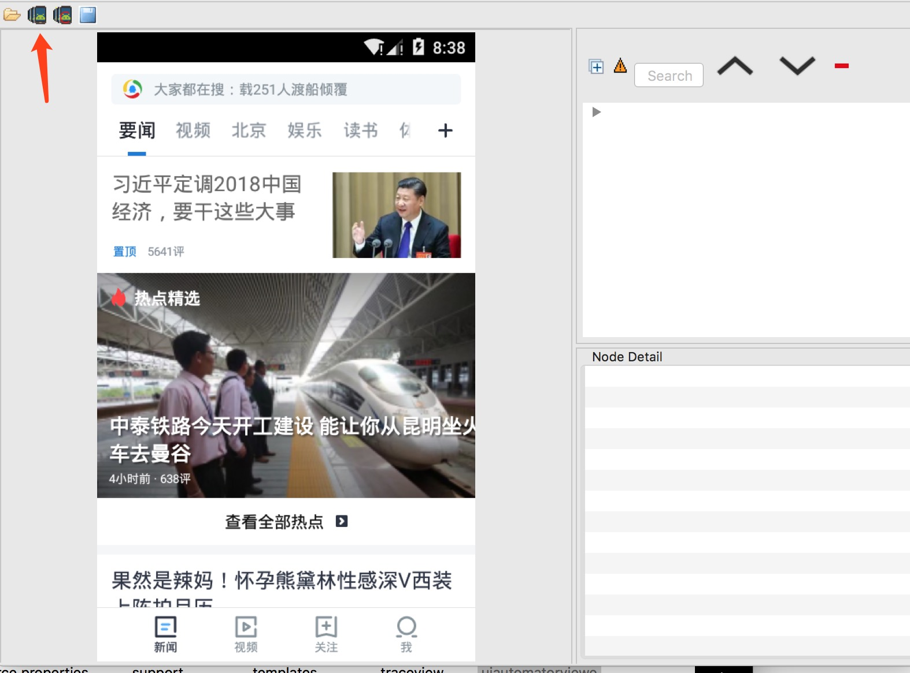
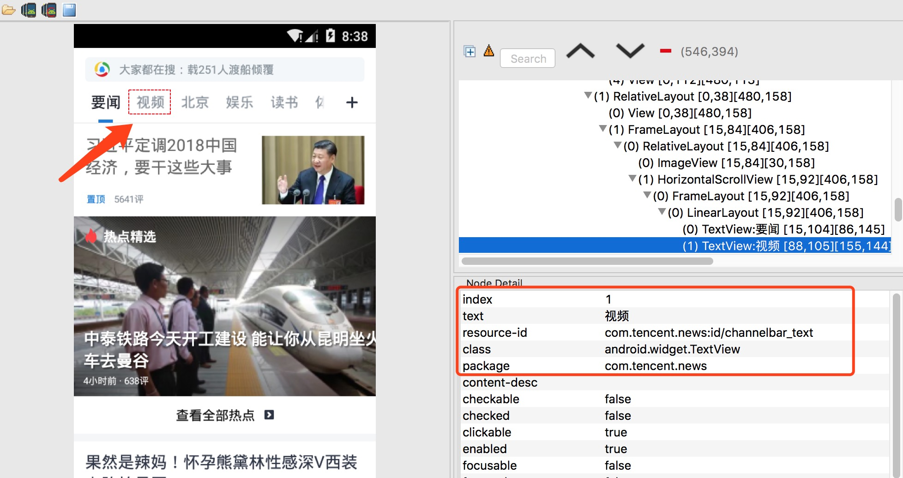
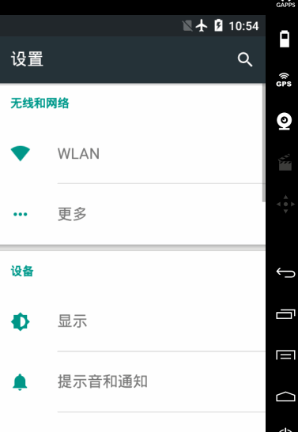
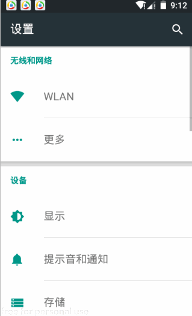
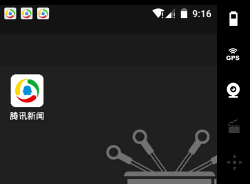
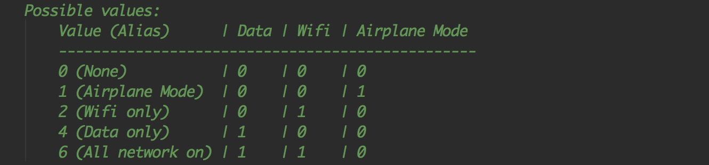
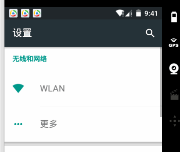

## 07.Appium 基础API

### App基础操作API

#### 前置代码

```
  # server 启动参数

  desired_caps = {}
  desired_caps['platformName'] = 'Android' 
  desired_caps['platformVersion'] = '5.1'
  desired_caps['deviceName'] = '192.168.56.101:5555'
  desired_caps['appPackage'] = 'com.android.settings'
  desired_caps['appActivity'] = '.Settings'

  # 声明driver对象
  driver = webdriver.Remote('http://127.0.0.1:4723/wd/hub', desired_caps)

```

####获取app包名和启动名

```
	获取包名方法：current_package
	获取启动名：current_activity
```
```
	业务场景：
		1.启动设置
		2.获取包名和启动名
```
```
	代码实现：
		print(driver.current_package)
    	print(driver.current_activity)
    执行结果：
    	com.tencent.news
    	.activity.SplashActivity
```
#### 脚本内启动其他app

```
    driver.start_activity(appPackage,appActivity)
    参数：
    	appPackage：包名
    	appActivity：启动名
    示例：
    	driver.start_activity('com.android.mms', '.ui.ConversationList')
```

#### 关闭app

```
	driver.close_app()  # 关闭当前操作的app，不会关闭驱动对象
```

#### 关闭驱动对象

```
	driver.quit()   # 关闭驱动对象，同时关闭所有关联的app
```

#### 安装APK到手机

```
	driver.install_app(app_path) 
	参数：
		app_path：脚本机器中APK文件路径
	示例：
		driver.install_app("/Users/Yoson/Downloads/anzhishichang_6450.apk")
```

#### 手机中移除APP

```
	driver.remove_app(app_id) 
	参数：
		app_id：需要卸载的app包名
	示例：
		driver.remove_app('cn.goapk.market')
```

#### 判断APP是否已安装

```
	driver.is_app_installed(app_id) 
	参数：
		bundle_id: 可以传入app包名,返回结果为True(已安装) / False(未安装)
	示例：
	print(driver.is_app_installed('cn.goapk.market'))
```

#### 发送文件到手机

```
	import base64
	data = str(base64.b64encode(data.encode('utf-8')),'utf-8')
	driver.push_file(path,data)
	参数：
		path：手机设备上的路径(例如：/sdcard/a.txt)
		data：文件内数据,要求base64编码
		Python3.x中字符都为unicode编码，而b64encode函数的参数为byte类型，需要先转码；生成的数据为byte类型，需要将byte转换回去。
	示例：
		import base64
		data = str(base64.b64encode('test 123'.encode('utf-8')), 'utf-8')
		driver.push_file('/sdcard/test.txt', data)
```

#### 从手机中拉取文件

```
	import base64
	data = driver.pull_file(path) # 返回数据为base64编码
	print(str(base64.b64decode(data),'utf-8')) # base64解码
	参数：
		path: 手机设备上的路径
	示例：
		import base64
		data = driver.pull_file('/sdcard/test.txt') # 返回数据为base64编码
		print(str(base64.b64decode(data), 'utf-8')) # base64解码
```

#### 获取当前屏幕内元素结构

```
	driver.page_source  
	作用：
		返回当前页面的文档结构，判断特定的元素是否存在
	示例：
		print(driver.page_source)
```

####应用置于后台事件

```
	APP放置后台，模拟热启动
	方法：background_app(seconds)
	参数：
		1.seconds:停留在后台的时间，单位：秒
```
```
	业务场景：
		1.进入设置页
		2.将APP置于后台5s
```
```
	代码实现：
		driver.background_app(5)
	效果：
		app置于后台5s后，再次展示当前页面
```


## 08.UIAutomatorViewer

### 工具简介

用来扫描和分析Android应用程序的UI控件的工具.

### 如何使用

1.进入SDK目录下的tools目录，打开uiautomatorviewer

2.电脑连接真机或打开android模拟器

3.启动待测试app

4.点击uiautomatorviewer的左上角Device Screenshot,会生成app当前页面的UI控件截图





## 09.元素定位API

```
手工测试主要通过可见按钮操作，而自动化是通过元素进行交互操作.
⚠️⚠️⚠️ 元素的基本定位基于当前屏幕范围内展示的可见元素。
```
* Appium常用元素定位方式

| name  | value       |
| ----- | ----------- |
| id    | id属性值    |
| class | class属性值 |
| xpath | xpath表达式 |

* 前置代码

```
	from appium import webdriver
	# server 启动参数
	desired_caps = {}
	# 设备信息
	desired_caps['platformName'] = 'Android'
	desired_caps['platformVersion'] = '5.1'
	desired_caps['deviceName'] = '192.168.56.101:5555'
	# app的信息
	desired_caps['appPackage'] = 'com.android.settings'
	desired_caps['appActivity'] = '.Settings'

	# 声明我们的driver对象
	driver = webdriver.Remote('http://127.0.0.1:4723/wd/hub', desired_caps)
```

### 定位一个元素 element

#### 通过id定位

```
	方法：find_element_by_id(id_value) # id_value:为元素的id属性值
```
```
	业务场景:
		1.进入设置页面
		2.通过ID定位方式点击搜索按钮
```
```
	代码实现：
		driver.find_element_by_id("com.android.settings:id/search").click()
		driver.quit()
```

#### 通过class定位

```
	方法：find_element_by_class_name(class_value) # class_value:为元素的class属性值
```

```
	业务场景:
		1.进入设置页面
		2.点击搜索按钮
		3.通过class定位方式点击输入框的返回按钮
```
```
	代码实现：
		# id 点击搜索按钮
		driver.find_element_by_id("com.android.settings:id/search").click()
		# class 点击输入框返回按钮
		driver.find_element_by_class_name('android.widget.ImageButton').click()
		driver.quit()
```

#### 通过xpath定位

```
	方法：find_element_by_xpath(xpath_value) # xpath_value:为可以定位到元素的xpath语句
```
```
	*** android端xptah常用属性定位：
		1. id ://*[contains(@resource-id,'com.android.settings:id/search')] 
		2. class ://*[contains(@class,'android.widget.ImageButton')]
		3. text ://*[contains(@text,'WLA')]

	*** 模糊定位 contains(@key,value): value可以是部分值
```

```
	业务场景:
		1.进入设置页面
		2.点击WLAN菜单栏
```
```
	代码实现：
		# xpath 点击WLAN按钮
	    driver.find_element_by_xpath("//*[contains(@text,'WLA')]").click()
```

### 定位一组元素 elements

```
	应用场景为元素值重复，无法通过元素属性直接定位到某个元素，只能通过elements方式来选择，返回一个定位对象的列表.
```

#### 通过id方式定位一组元素

```
	方法： find_elements_by_id(id_value) # id_value:为元素的id属性值
```

```
	业务场景:
		1.进入设置页面
		2.点击WLAN菜单栏(id定位对象列表中第1个)
```

```
	代码实现：
		# 定位到一组元素
		title = driver.find_elements_by_id("com.android.settings:id/title")
		# 打印title类型，预期为list
    	print(type(title))
    	# 取title返回列表中的第一个定位对象，执行点击操作
    	title[0].click()
```

#### 通过class方式定位一组元素

```
	方法：find_elements_by_class_name(class_value) # class_value:为元素的class属性值
```

```
	业务场景:
		1.进入设置页面
		2.点击WLAN菜单栏(class定位对象列表中第3个)
```

```
	代码实现：
		# 定位到一组元素
		title = driver.find_elements_by_class_name("android.widget.TextView")
		# 打印title类型，预期为list
    	print(type(title))
    	# 取title返回列表中的第一个定位对象，执行点击操作
    	title[3].click()
```

#### 通过xpath方式定位一组元素

```
	方法:find_elements_by_xpath(xpath_value) # xpath_value:为可以定位到元素的xpath语句
```

```
	业务场景:
		1.进入设置页面
		2.点击WLAN菜单栏(xpath中class属性定位对象列表中第3个)
```

```
	代码实现：
		# 定位到一组元素
		title = driver.find_elements_by_xpath("//*[contains(@class,'widget.TextView')]")
		# 打印title类型，预期为list
    	print(type(title))
    	# 取title返回列表中的第一个定位对象，执行点击操作
    	title[3].click()
```
### WebDriverWait 显示等待 

```
	在一个超时时间范围内，每隔一段时间去搜索一次元素是否存在，
	如果存在返回定位对象，如果不存在直到超时时间到达，报超时异常错误。
```

```
	方法:WebDriverWait(driver, timeout, poll_frequency).until(method)
	参数：
		1.driver：手机驱动对象
		2.timeout：搜索超时时间
		3.poll_frequency：每次搜索间隔时间，默认时间为0.5s
		4.method：定位方法(匿名函数)
```

```
	匿名函数: 
		lambda x: x
	等价于python函数：
		def test(x):
    		return x
```

```
	使用示例：
		from selenium.webdriver.support.wait import WebDriverWait
		WebDriverWait(driver, timeout, poll_frequency).until(lambda x: x.find_elements_by_id(id_value))
	解释：
		1.x传入值为：driver，所以才可以使用定位方法.
	函数运行过程：
		1.实例化WebDriverWait类，传入driver对象，之后driver对象被赋值给WebDriverWait的一个类变量：self._driver
		2.until为WebDriverWait类的方法，until传入method方法(即匿名函数)，之后method方法会被传入self._driver
		3.搜索到元素后until返回定位对象，没有搜索到函数until返回超时异常错误.
```

```
	业务场景:
		1.进入设置页面
		2.通过ID定位方式点击搜索按钮
```

```
	代码实现：
		from selenium.webdriver.support.wait import WebDriverWait # 导入WebDriverWait类
		# 超时时间为30s，每隔1秒搜索一次元素是否存在，如果元素存在返回定位对象并退出
		search_button = WebDriverWait(driver, 30, 1).until(lambda x: x.find_elements_by_id(com.android.settings:id/search))
		search_button.click()
```
## 10.元素操作API

```
	本节讲介绍手机端元素信息的获取以及基本的输入操作。
```
* 前置代码

```
	from appium import webdriver
	# server 启动参数
	desired_caps = {}
	# 设备信息
	desired_caps['platformName'] = 'Android'
	desired_caps['platformVersion'] = '5.1'
	desired_caps['deviceName'] = '192.168.56.101:5555'
	# app的信息
	desired_caps['appPackage'] = 'com.android.settings'
	desired_caps['appActivity'] = '.Settings'

	# 声明我们的driver对象
	driver = webdriver.Remote('http://127.0.0.1:4723/wd/hub', desired_caps)
```
### 点击元素
```
	方法：click() 
```
```
	业务场景:
		1.打开设置
		2.点击搜索按钮
```

```
	代码实现：
		# 点击搜索按钮
    	driver.find_element_by_id("com.android.settings:id/search").click()
```
### 发送数据到输入框

```
	方法：send_keys(value) # value：需要发送到输入框内的文本
```
```
	业务场景:
		1.打开设置
		2.点击搜索按钮
		3.输入内容abc
```

```
	代码实现：
		# 点击搜索按钮
    	driver.find_element_by_id("com.android.settings:id/search").click()
    	# 定位到输入框并输入abc
    	driver.find_element_by_id("android:id/search_src_text").send_keys("abc")

    重点:
    	大家可以将输入的abc 改成 输入中文，得到的结果:输入框无任何值输入且程序不会抱错
```
```
	解决输入中文问题：

		1.server 启动参数增加两个参数配置
			desired_caps['unicodeKeyboard'] = True
			desired_caps['resetKeyboard'] = True

		2.再次运行会发现运行成功
			# 点击搜索按钮
	    	driver.find_element_by_id("com.android.settings:id/search").click()
	    	# 定位到输入框并输入abc
	    	driver.find_element_by_id("android:id/search_src_text").send_keys("传智播客")
```
### 清空输入框内容

```
	方法：clear()
```
```
	业务场景:
		1.打开设置
		2.点击搜索按钮
		3.输入内容abc
		4.删除已输入abc
```
```
	代码实现：
		# 点击搜索按钮
	    driver.find_element_by_id("com.android.settings:id/search").click()
	    # 定位到输入框并输入abc
	    input_text = driver.find_element_by_id("android:id/search_src_text")
	    # 输入abc
	    input_text.send_keys("abc")
	    time.sleep(1)
	    # 删除abc
	    input_text.clear()
```

### 获取元素的文本内容

```
	方法: text
```
```
	业务场景：
		1.进入设置
		2.获取所有元素class属性为“android.widget.TextView”的文本内容
```
```
	代码实现：
		text_vlaue = driver.find_elements_by_class_name("android.widget.TextView")
	    for i in text_vlaue:
	        print(i.text)
	执行结果：
		设置

		无线和网络
		WLAN
		更多
		设备
		显示
		提示音和通知
		存储
```
### 获取元素的属性值

```
	方法: get_attribute(value) # value:元素的属性
	⚠️ value='name' 返回content-desc / text属性值
	⚠️ value='text' 返回text的属性值
	⚠️ value='className' 返回 class属性值，只有 API=>18 才能支持
	⚠️ value='resourceId' 返回 resource-id属性值，只有 API=>18 才能支持
```
```
	业务场景：
		1.进入设置
		2.获取搜索按钮的content-desc属性值
```

```
	代码实现：
		# 定位到搜索按钮
		get_value = driver.find_element_by_id("com.android.settings:id/search")
    	print(get_value.get_attribute("name"))
    执行结果：
    	搜索
```
### 获取元素在屏幕上的坐标

```
	方法:location
```
```
	业务场景：
		1.进入设置页面
		2.获取搜索按钮在屏幕的坐标位置
```
```
	代码实现:
		# 定位到搜索按钮
	    get_value = driver.find_element_by_id("com.android.settings:id/search")
	    # 打印搜索按钮在屏幕上的坐标
	    print(get_value.location)
	执行结果:
		{'y': 44, 'x': 408}
```

## 11.滑动和拖拽事件

* 前置代码

```
	from appium import webdriver
	# server 启动参数
	desired_caps = {}
	# 设备信息
	desired_caps['platformName'] = 'Android'
	desired_caps['platformVersion'] = '5.1'
	desired_caps['deviceName'] = '192.168.56.101:5555'
	# app的信息
	desired_caps['appPackage'] = 'com.android.settings'
	desired_caps['appActivity'] = '.Settings'

	# 声明我们的driver对象
	driver = webdriver.Remote('http://127.0.0.1:4723/wd/hub', desired_caps)
```
### swipe 滑动事件

```
	⚠️从一个坐标位置滑动到另一个坐标位置,只能是两个点之间的滑动
	方法：swipe(start_x, start_y, end_x, end_y, duration=None)
	参数：
		1.start_x：起点X轴坐标
		2.start_y：起点Y轴坐标
		3.end_x：  终点X轴坐标
		4.end_y,： 终点Y轴坐标
		5.duration： 滑动这个操作一共持续的时间长度，单位：ms
```
```
	业务场景：
		1.进入设置
		2.从坐标(148,659)滑动到坐标(148,248)
```
```
	代码实现：
		# 滑动没有持续时间
		driver.swipe(188,659,148,248)
		# 滑动持续5秒的时间
		driver.swipe(188,659,148,248,5000)
```

### scroll 滑动事件

```
	⚠️ 从一个元素滑动到另一个元素，直到页面自动停止
	方法：scroll(origin_el, destination_el)
	参数：
		1.origin_el：滑动开始的元素
		2.destination_el：滑动结束的元素
```
```
	业务场景：
		1.进入设置页
		2.模拟手指从存储菜单位置 到 WLAN菜单位置的上滑操作
```
```
	代码实现：
		# 定位到存储菜单栏
		el1 = driver.find_element_by_xpath("//*[contains(@text,'存储')]")
		# 定位到WLAN菜单栏
	    el2 = driver.find_element_by_xpath("//*[contains(@text,'WLAN')]")
	    # 执行滑动操作
	    driver.scroll(el1,el2)
```
### drag 拖拽事件

```
	⚠️ 从一个元素滑动到另一个元素,第二个元素替代第一个元素原本屏幕上的位置
	方法：drag_and_drop(origin_el, destination_el)
	参数：
		1.origin_el：滑动开始的元素
		2.destination_el：滑动结束的元素
```
```
	业务场景：
		1.进入设置页
		2.模拟手指将存储菜单 滑动到 WLAN菜单栏位置
```
```
	代码实现：
		# 定位到存储菜单栏
		el1 = driver.find_element_by_xpath("//*[contains(@text,'存储')]")
		# 定位到WLAN菜单栏
	    el2 = driver.find_element_by_xpath("//*[contains(@text,'WLAN')]")
	    # 执行滑动操作
	    driver.drag_and_drop(el1,el2)
```

## 12.高级手势TouchAction

```
	TouchAction是AppiumDriver的辅助类，主要针对手势操作，比如滑动、长按、拖动等，
	原理是将一系列的动作放在一个链条中发送到服务器，服务器接受到该链条后，解析各个动作，逐个执行。
```
⚠️ 所有手势都要通过执行perform()函数才会运行.

### 手指轻敲操作

```
	模拟手指轻敲一下屏幕操作
	方法：tap(element=None, x=None, y=None)
	方法：perform() # 发送命令到服务器执行操作
	参数：
		1.element：被定位到的元素
		2.x：相对于元素左上角的坐标，通常会使用元素的X轴坐标
		3.y：通常会使用元素的Y轴坐标
```
```
	业务场景：
		1.进入设置
		2.点击WLAN选项
```
```
	代码实现：
		# 通过元素定位方式敲击屏幕
	    el = driver.find_element_by_xpath("//*[contains(@text,'WLAN')]")
	    TouchAction(driver).tap(el).perform()

	    # 通过坐标方式敲击屏幕，WLAN坐标:x=155,y=250
	    # TouchAction(driver).tap(x=155,y=250).perform()
```

### 手指按下和抬起操作

```
	模拟手指按下屏幕,按就要对应着离开.
```
```
	方法:press(el=None, x=None, y=None)
	方法:release() # 结束动作，手指离开屏幕
	参数：
		1.element：被定位到的元素
		2.x：通常会使用元素的X轴坐标
		3.y：通常会使用元素的Y轴坐标
```
```
	业务场景:
		1.进入设置
		2.点击WLAN选项
```
```
	代码实现：
		# 通过元素定位方式按下屏幕
	    el = driver.find_element_by_xpath("//*[contains(@text,'WLAN')]")
	    TouchAction(driver).press(el).release().perform()

	    # 通过坐标方式按下屏幕，WLAN坐标:x=155,y=250
	    # TouchAction(driver).press(x=155,y=250).release().perform()
```
### 等待操作

```
	方法：wait(ms=0)
	参数：
		ms：暂停的毫秒数

```

```
	业务场景:
		1.进入设置
		2.点击WLAN选项
		3.长按WiredSSID选项5秒

```

```
	代码实现：
		# 点击WLAN
	    driver.find_element_by_xpath("//*[contains(@text,'WLAN')]").click()
	    # 定位到WiredSSID
	    el =driver.find_element_by_id("android:id/title")
	    # 通过元素定位方式长按元素
	    TouchAction(driver).press(el).wait(5000).perform()

	    # TouchAction(driver).press(x=171,y=245).wait(5000).release().perform() ⚠️ 该方法未能完成长按操作，没有报任何错误

```

### 手指长按操作

```
	模拟手机按下屏幕一段时间,按就要对应着离开.
```
```
	方法：long_press(el=None, x=None, y=None, duration=1000)
	参数：
		1.element：被定位到的元素
		2.x：通常会使用元素的X轴坐标
		3.y：通常会使用元素的Y轴坐标
		4.duration：持续时间，默认为1000ms
```
```
	业务场景:
		1.进入设置
		2.点击WLAN选项
		3.长按WiredSSID选项5秒
```
```
	代码实现：
		# 点击WLAN
	    driver.find_element_by_xpath("//*[contains(@text,'WLAN')]").click()
	    # 定位到WiredSSID
	    el =driver.find_element_by_id("android:id/title")
	    # 通过元素定位方式长按元素
	    TouchAction(driver).long_press(el,duration=5000).release().perform()
```
### 手指移动操作

```
	模拟手机的滑动操作
	方法：move_to(el=None, x=None, y=None)
	参数:
		1.el:定位的元素
		2.x:相对于前一个元素的X轴偏移量
		3.y:相对于前一个元素的Y轴偏移量
```
```
	业务场景：
		1.进入设置
		2.向上滑动屏幕
```

```
	代码实现：
    	# 定位到存储
	    el = driver.find_element_by_xpath("//*[contains(@text,'存储')]")
	    # 定位到更多
	    el1 = driver.find_element_by_xpath("//*[contains(@text,'更多')]")
	    # 元素方式滑动
	    TouchAction(driver).press(el).move_to(el1).release().perform()
	    # 坐标的方式滑动
	    # TouchAction(driver).press(x=240,y=600).wait(100).move_to(x=100,y=100).release().perform()

```
关于moveto的问题：https://blog.csdn.net/wanglha/article/details/52203704

### 案例-手势解锁

```
	需求：
		1.进入设置
		2.向上滑动屏幕到可见"安全"选项
		3.进入到安全
		4.点击屏幕锁定方式
		5.点击图案
		6.绘制图案
```

```
示例代码：

# 需要进入的页面
page_name = "安全"

# 如果找到就点击，如果没有往下滑，再次重新找，直到找到。
while True:
    try:
        driver.find_element_by_xpath("//*[contains(@text,'" + page_name + "')]").click()
        break
    except Exception:
        driver.swipe(100, 2000, 100, 1000)
        time.sleep(1)

driver.find_element_by_xpath("//*[contains(@text,'屏幕锁定')]").click()
time.sleep(1)
driver.find_element_by_xpath("//*[contains(@text,'图案')]").click()
time.sleep(1)
TouchAction(driver).press(x=233, y=834).move_to(x=0, y=480).move_to(x=480, y=0).move_to(x=480, y=-480).move_to(x=0, y=480).move_to(x=0, y=480).release().perform()
```


## 13.手机操作API

```
	针对手机的一些常用设置功能进行操作.
```
### 获取手机时间

```
	方法：device_time
```
```
	代码实现：
		# 获取当前手机的时间
		print(driver.device_time)
	执行结果：
		Wed Dec 27 08:52:45 EST 2017
```
### 获取手机的宽高

```
	获取手机的宽高，可以根据宽高做一些坐标的操作
```
```
	方法：get_window_size()
```
```
	代码实现：
		print(driver.get_window_size())
	执行结果：
		{'height': 800, 'width': 480}
```
### 发送键到设备

```
	模拟系统键值的操作，比如操作honme键，音量键,返回键等。
```
```
	方法：keyevent(keycode, metastate=None):
	方法：press_keycode(keycode, metastate=None):
	参数：
		keycode：发送给设备的关键代码
		metastate：关于被发送的关键代码的元信息，一般为默认值
```
```
	业务场景:
		1.打开设置
		2.按多次音量增加键
```
```
	代码实现：
		for i in range(3):
        	driver.keyevent(24)
```

### 操作手机通知栏

```
	打开手机的通知栏，可以获取通知栏的相关信息和元素操作
```
```
	方法：open_notifications()
```
```
	业务场景: 
		1.启动设置
		2.打开通知栏
```
```
	代码实现：
		driver.open_notifications()
```

### 获取手机当前网络

```
	获取手机当前连接的网络
```
```
	方法：network_connection
```
```
	业务场景:
		获取手机当前网络模式
```
```
	代码实现：
		print(driver.network_connection)
	执行结果：
		6
```

### 设置手机网络

```
	更改手机的网络模式，模拟特殊网络情况下的测试用例
```
```
	方法：set_network_connection(connectionType)
	参数：
		connectionType：需要被设置成为的网络类型
```
```
	业务场景：
		1.启动设置
		2.设置手机网络为飞行模式
```
```
	代码实现：
		driver.set_network_connection(1)
```

### 手机截图

```
	截取手机当前屏幕，保存指定格式图片到设定位置
```
```
	方法：get_screenshot_as_file(filename)
	参数：
		filename：指定路径下，指定格式的图片.
```
```
	业务场景：
		1.打开设置页面
		2.截图当前页面保存到当前目录，命名为screen.png
```
```
	代码实现：
		import os
	    driver.get_screenshot_as_file(os.getcwd() + os.sep + './screen.png')
	执行结果：
		当前目录下会生成screen.png文件
```
