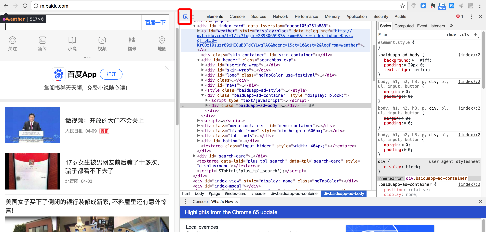
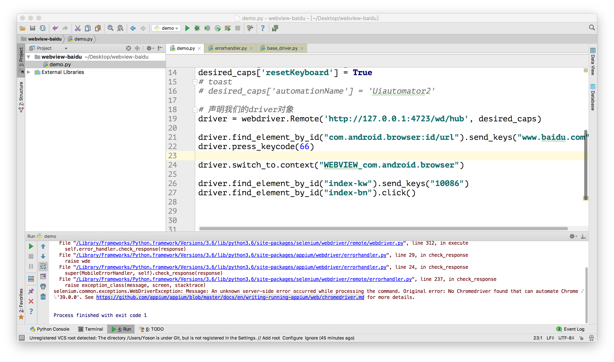
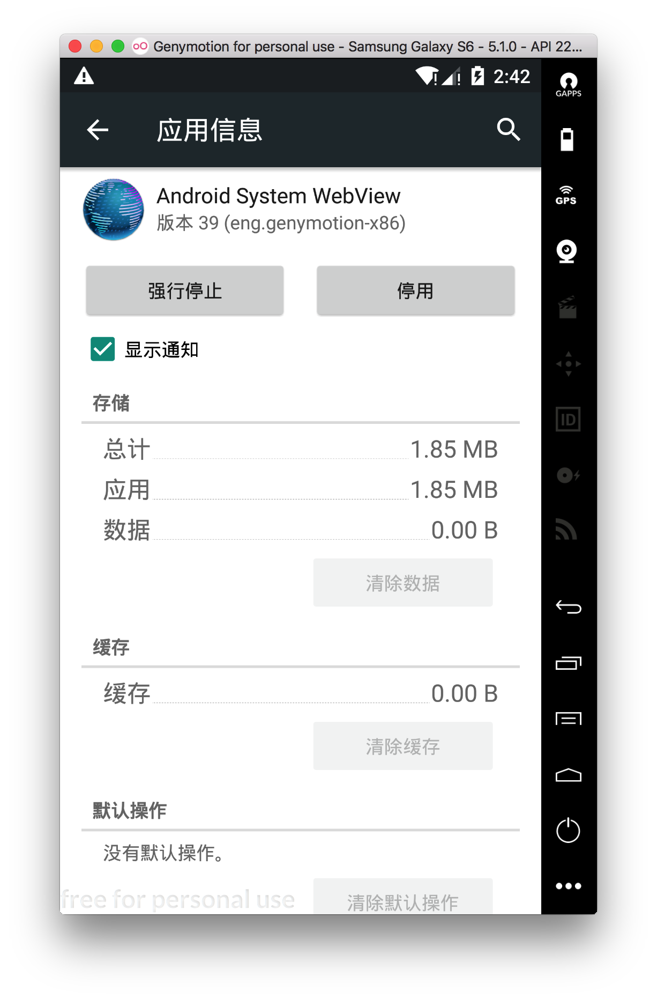
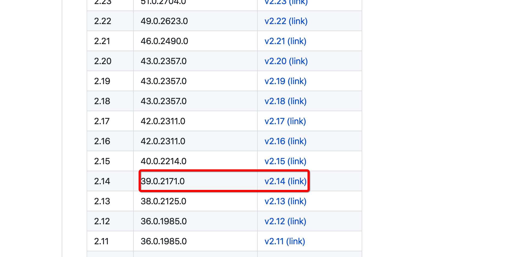
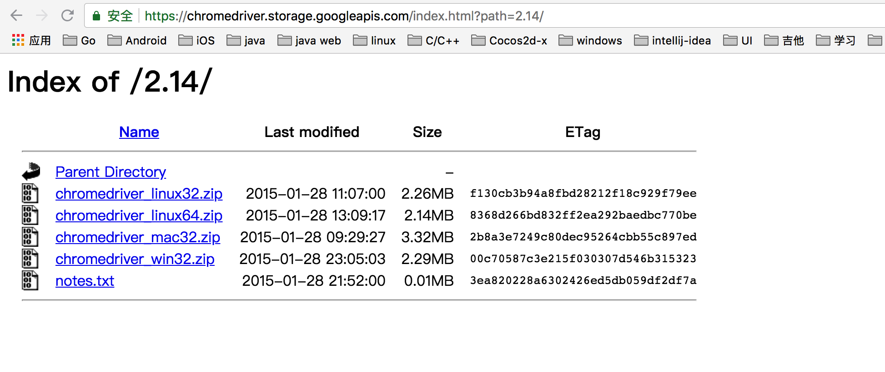

### webview

#### 查看webview元素的方式

在浏览器中 输入 chrome://inspect 地址

可以看到对用的手机设备，已经已经有的webview


- 方式1

  - 通过自己电脑上的浏览器chrom打开对应的手机的webview的页面（如果有）

  - 在页面点击右键，选择检查。（不是查看源代码）

  - 点击红色右边的按钮进入手机模式

  - 点击红色的按钮，进入查看元素的模式

    

  - 

  ​

  - 选中需要查看的控件，右侧源码即可跳转。

- 方式2
  - 点击inspect查看元素信息。

#### 实现webview自动化

- 前置代码，和之前相同（打开的包名和启动名是浏览器软件）

- 获取，driver的所有的上下文。

  - 得到，一个原生的app的字符串，还有其他各种webview的字符串。

    ```
    contexts = driver.contexts
    for i in contexts:
        print(i)
    ```

  - 如：

  - NATIVE_APP
    WEBVIEW_cn.goapk.market
    WEBVIEW_com.android.browser

- 通过，driver的switchto来切换上下文

  ```
  # 告诉appium需要查找的是 com.android.browser程序的webview的内容
  driver.switch_to.context("WEBVIEW_com.android.browser")
  ```

- 切换后可以使用selenium的方法进行元素定位

- 包括，点击已经输入文字等api都是相同的。

#### 关于没有对应chromedriver的大坑

错误为：



打开提示的网址：

https://github.com/appium/appium/blob/master/docs/en/writing-running-appium/web/chromedriver.md

此处有chrome版本对应的chromedriver版本

需要下载chromedriver。下载哪个版本？

看自己手机的浏览器的版本，在设置-应用-全部-android system webview



找到对应的下载地址：



通过link下载。



解压zip会得到一个chromedriver文件。

启动appium时，参数指定chromedriver路径：

```
appium --chromedriver-executable 解压后的chromedriver的路径
```

#### 关于inspect空白

需要翻墙一次！