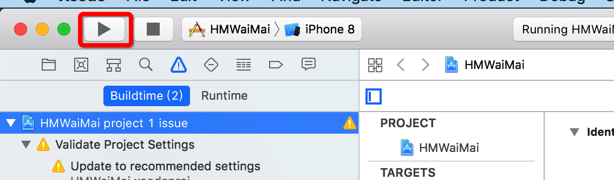
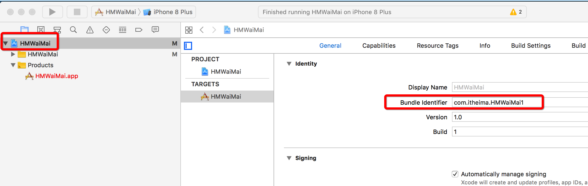
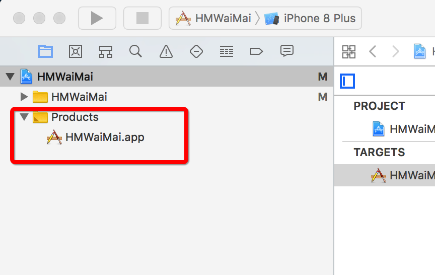
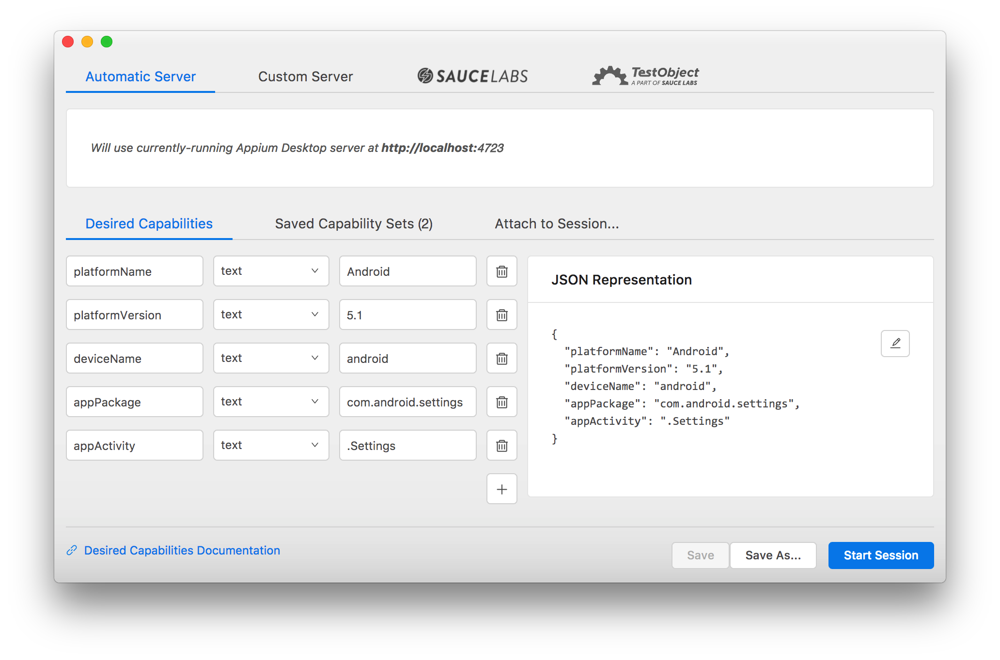
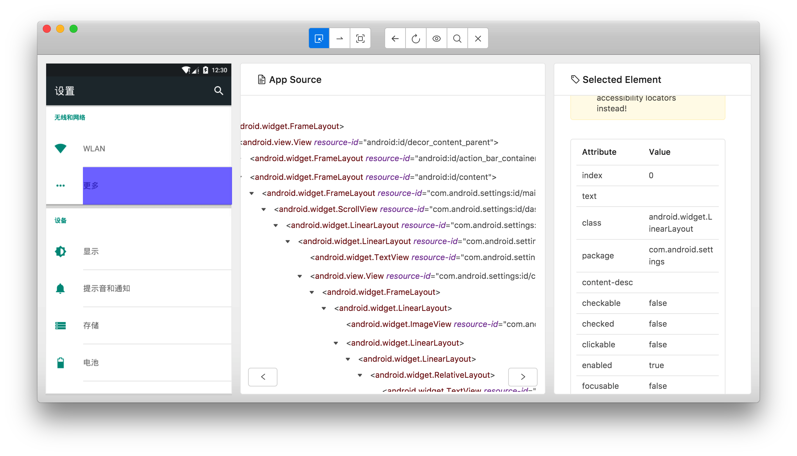
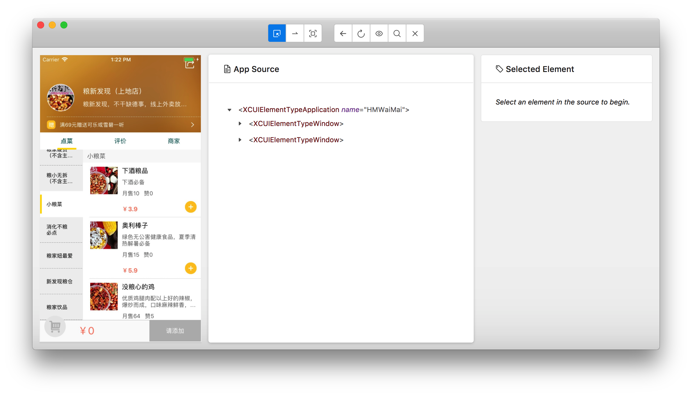
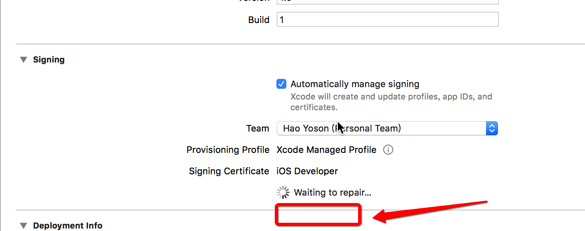

### iOS

#### 运行iOS项目

快捷键 command + r

或者

点击左上角“播放”按钮

编译的快捷键 command + b




#### iOS前置代码

```
# server 启动参数
desired_caps = {}
# 设备信息
desired_caps['platformName'] = 'iOS'
desired_caps['platformVersion'] = '11.3'
desired_caps['deviceName'] = 'iPhone 8 Plus'
# app的信息
desired_caps['app'] = "com.itheima.HMWaiMai1"
# 解决输入中文
desired_caps['unicodeKeyboard'] = True
desired_caps['resetKeyboard'] = True

# 不要重置应用
desired_caps['noReset'] = True

# 声明我们的driver对象
driver = webdriver.Remote('http://127.0.0.1:4723/wd/hub', desired_caps)
```

##### 已经安装

```
desired_caps['app'] = "com.itheima.HMWaiMai1"
```

要一份源码，打开Xcode，选择对应模拟器，“command+r”运行



```
desired_caps['deviceName'] = 'iPhone 8'
# 这个key “deviceName” 在iOS中是有用的。在android中可以随便写，只要不是不传或空字符串都可以。但是，在iOS中，应该写对应的设备名字，如果名字是正确的(iPhone 6s)，会重新打开，如果没有对应的设备名字，会报错。
```

##### 没有安装

```
desired_caps['app'] = os.path.abspath("./HMWaiMai.app")  # 建议！！！
```

```
desired_caps['app'] = "./test_ios/HMWaiMai.app"
```

找到项目下的Products文件夹，里面有项目名.app，如果为红色，按下“command+b”进行编译，自动生成。



对着 项目.app 右键 - 选择 show in finder（在资源管理器中打开）- 直接把这个app拖到终端中，即可查看路径。

#### appium查看元素-android

```
mac: appium - new session window 

windows: file - new session window 
```

desired capabilities 中填写对应前置代码的key-value



点击start session即可

#### appium左侧三个功能

- 选择元素
- 模拟滑动
- 点击

#### appium右侧五个功能

- 返回
- 刷新
- 录制脚本（代码）
- 搜索
- 退出

#### appium查看元素-iOS

原理和 android 相同

写入对应的前置代码参数即可



#### 点击事件

test_ios.py

```
import os, sys

sys.path.append(os.getcwd())

from base.base_driver import init_iOS_driver
from page.login_page import LoginPage


class Test_ios:

    def setup(self):
        self.driver = init_iOS_driver()
        self.login_page = LoginPage(self.driver)

    def test_login(self):
        self.login_page.click_rice()

```

login_page.py

```
from selenium.webdriver.common.by import By

from base.base_action import BaseAction

class LoginPage(BaseAction):

    rice = By.XPATH, "name,地狱饭"

    def click_rice(self):
        self.find_element(self.rice).click()
```

#### 滑动

只用之前的base进行验证

```
self.login_page.scroll_page_one_time()
```

###iOS真机调试

配置三个东西

- 电脑
- 手机
- 应用程序

xcode - 属性 - 账户 - 左下角+号 - 输入开发者账号

