## 01.移动端测试知识概览

### 01.1 移动端测试是什么？

移动端测试是指对移动应用进行的测试，即实体的特性满足需求的程度。

### 01.2 移动端测试分类？

- app功能测试
  - 业务逻辑正确性测试
    - 文档
  - 兼容性测试
    - 系统版本
    - 分辨率
    - 网络情况
  - 异常测试
    - 热启动应用
    - 网络切换&中断恢复
    - 电话&信息中断恢复
  - 升级&安装卸载测试
  - 健壮性测试
    - 手机资源消耗
    - 流量消耗
    - 崩溃恢复等测试
- app自动化测试
  - 通过场景和数据的预设，把以人为驱动的测试行为转化为机器执行的一种过程，并不是所有功能都能进行自动化。
- app安全测试
  - 通过安全测试技术，保证app尽可能的不存在安全漏洞.

### 01.3 市场招聘如何？

互联网移动场景下业务的爆发，导致移动端开发和测试人员需求量增大，市场很缺移动端的人才。

公司待遇：

1. app功能测试，一般1-3年的功能测试人员月薪8k-15k
2. app自动化测试，一般1-3年的自动化测试月薪13k-25k

## 02.移动端测试环境搭建

我们的目标是Android测试，所以环境需要搭建三个，Java，AndroidSDK，Android模拟器。

为什么要安装这三个环境，我们倒着来说：

Android模拟器：实际上就是一台手机，方便我们给大家展示效果。

AndroidSDK：Android SDK给你提供开发测试所必须的Android API类库。

Java：Android的底层是c、c++，应用层用的语言是Java所以需要使用Java环境。

### 02.1 Java环境

#### windows

安装JDK1.8

```
运行jdk-8u151-windows-x64.exe文件，默认安装即可(例如我的安装目录：C:\Program Files\Java\jdk1.8.0)
```

配置java环境变量(Windowns7为例)

```
1.进入我的电脑 -> 属性 -> 高级系统设置 -> 环境变量

2.在系统变量下点击新建 -> 变量名: JAVA_HOME -> 变量值: C:\Program Files\Java\jdk1.8.0 -> 点击确定按钮

3.在系统变量下点击新建 -> 变量名: CLASSPATH -> 变量值: .;%JAVA_HOME%\lib;%JAVA_HOME%\lib\tools.jar(***变量值最前面有一个".") -> 点击确定按钮

4.在系统变量下找到系统的path变量，进入在最后添加：;%JAVA_HOME%\bin;%JAVA_HOME%\jre\bin(最前面是一个分号，如果path变量最后已有分号，可不用添加) -> 点击确定按钮
```

验证环境变量

```
1.win+r 或者 开始 -> 搜索框输入cmd

2.在界面运行java -version

3.出现版本即可
```

#### macOS

安装JDK

```
安装 jdk-8u151-macosx-x64.dmg
```

配置环境变量

```
1.进入命令行， vim ~/.bash_profile 
2.# set jdk1.8
JAVA_HOME=/Library/Java/JavaVirtualMachines/jdk1.8.0_151.jdk/Contents/Home
CLASSPATH=.:$JAVA_HOME/lib/dt.jar:$JAVA_HOME/lib/tools.jar
PATH=$PATH:$JAVA_HOME/bin
export JAVA_HOME CLASSPATH
export PATH
```

验证

```
1.打开终端

2.在界面运行java -version

3.出现版本即可
```

### 02.2 AndroidSDK环境

#### windows

将SDK保存到硬盘

```
Android SDK文件夹解压到任意目录(记住这个目录的位置，目录不要有中文)
```

配置环境变量

```
1.进入我的电脑 -> 属性 -> 高级系统设置 -> 环境变量

2.在系统变量下点击新建 -> 变量名: ANDROID_HOME -> 变量值: D:\android-sdk -> 点击确定按钮

3.在系统变量下找到系统的path变量，最后添加：;%ANDROID_HOME%\platform-tools;%ANDROID_HOME%\tools;(最前面是一个分号，如果path变量最后已有分号，可不用添加) -> 点击确定按钮
```

验证环境变量

```
重启命令行工具，命令行输入adb，不报错即可
```

#### macOS

将SDK保存到硬盘

```
Android SDK文件夹解压到任意目录(记住这个目录的位置，目录不要有中文)
```

配置环境变量

```
1.进入命令行， vim ~/.bash_profile
2.# set android
ANDROID_HOME=电脑存放的路径/android-sdk-macosx

PATH=$PATH:$ANDROID_HOME/tools:$ANDROID_HOME/platform-tools

export ANDROID_HOME 
export PATH
```

验证环境变量

```
重启命令行工具，命令行输入adb，不报错即可
```

#### 可能出现的问题

- 尽量不要手写
- 注意分号
- 配置好以后，cmd需要重启再输入adb
- 选择androidSDK的目录，不是jdk的目录

#### 补充：下载其他版本SDK

1.win或mac的命令行中输入android

2.因国外下载较慢，所以需要配置国内镜像

**windows**

```
在弹出的Android SDk Manager页面，点击Tools ，下拉框点击Options...
```

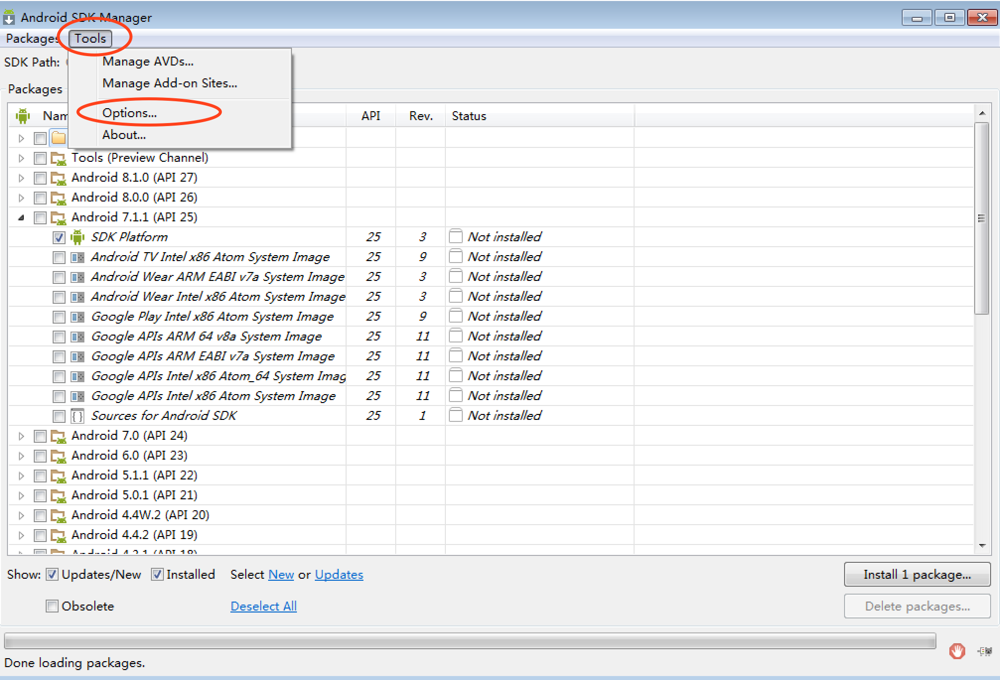


**mac**

```
点击Android SDk Manager，点击preferences
```

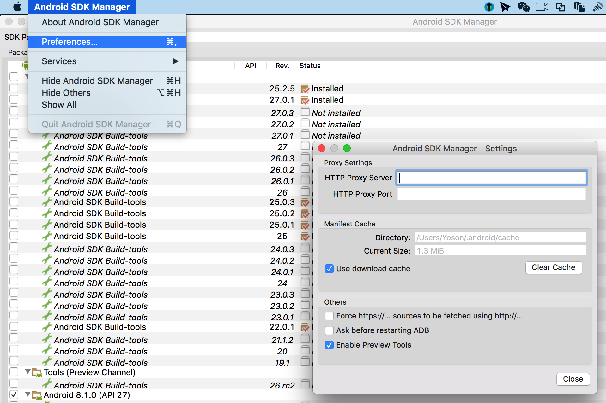

```
镜像地址列表(也可以网上查找最新的)：

	中国科学院开源协会镜像站地址:

		IPV4/IPV6: mirrors.opencas.cn 端口：80

		IPV4/IPV6: mirrors.opencas.org 端口：80

		IPV4/IPV6: mirrors.opencas.ac.cn 端口：80

	上海GDG镜像服务器地址:

		sdk.gdgshanghai.com 端口：8000

	北京化工大学镜像服务器地址:

		IPv4: ubuntu.buct.edu.cn/ 端口：80

		IPv4: ubuntu.buct.cn/ 端口：80

		IPv6: ubuntu.buct6.edu.cn/ 端口：80

	大连东软信息学院镜像服务器地址:

		mirrors.neusoft.edu.cn 端口：80
```

### 02.3 Android模拟器安装

#### windows

模拟器Genymotion安装

```
1.执行genymotion-2.11.0-vbox.exe(是一个集合程序，包含genymotion和virtualbox) -> 不需要更改配置，直接下一步默认安装

2.安装完genymotion继续等待，会提示安装virtualbox，继续安装，期间会提示安装oracle插件，全部允许安装

3.安装完成后会在桌面展示genymotion和virtualbox两个图标
```


虚拟机镜像导入

```
1.打开virtualbox

2.进入virtualbox -> 管理 -> 导入虚拟电脑

3.点击文件选择(Samsung Galaxy S6 - 5.1.0 - API 22 - 1440x2560.ova) -> 点击下一步

4.勾选 重新初始化所有网卡的MAC地址

5.点击导入按钮 -> 等待倒入完成

6.virtualbox列表会展示如下图圈出的选项
```


启动android模拟器

```
1.点击genymotion图标 -> 弹出框点击 >Personal Use

2.同意条款

3.genymotion主界面选择系统后点机start按钮

4.启动成功
```

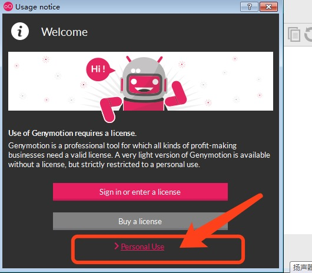

#### macOS

请阅读Windows的使用方法后再阅读mac，因为两者基本一致。

模拟器Genymotion安装

```
1.安装VirtualBox-5.1.30-OSX.dmg

2.安装genymotion-2.11.0.dmg
```

虚拟机镜像导入

```
1.双击Samsung Galaxy S6 - 5.1.0 - API 22 - 1440x2560.ova

2.点击导入
```

启动android模拟器

```
同 windows
```

#### 可能出现的问题

- VirtualBox 创建com对象失败 应用程序被中断
  - https://www.cnblogs.com/iluzhiyong/p/5597557.html
- genymotion unable to start the virtual XXXXXX
  - 更新vm
  - 管理 - 检查更新

#### 为虚拟机提供安装apk功能

```
1.安装genymotion ARM插件，此插件可提供x86运行环境，即可运行apk，需要下载对应版本的插件(本次使用android 5.1版本插件)

2.拖动ARM_Translation_Lollipop_20160402.zip到已启动的android虚拟机上

3.点击提示的ok按钮

4.重启后生效
```

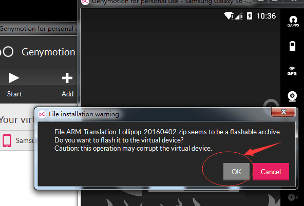

#### 补充：下载其他版本模拟器

需要注册一个genymotion账号，官网：https://www.genymotion.com

进入genymotion，点击Add按钮

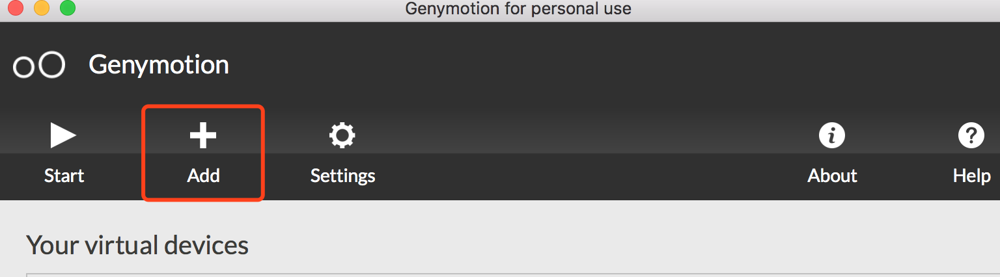

点击Sign in，输入注册的genymotion用户名和密码

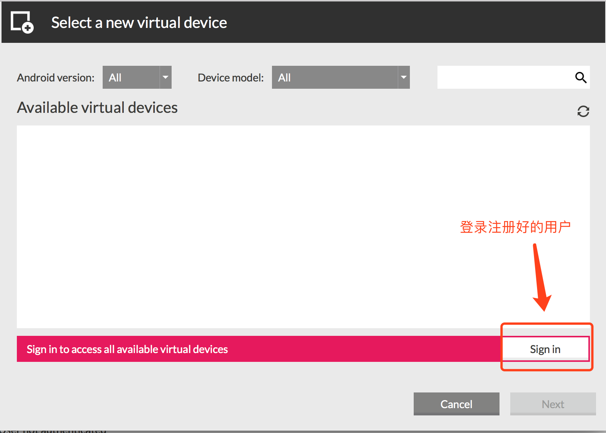

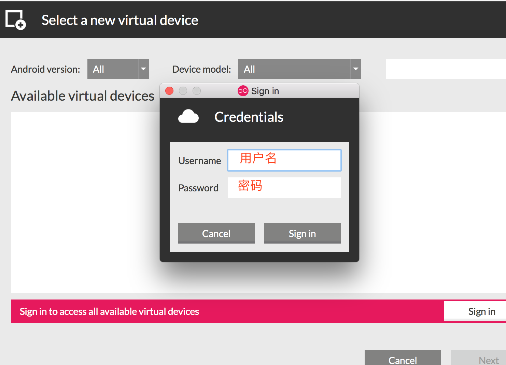

选择下载需要版本的模拟器

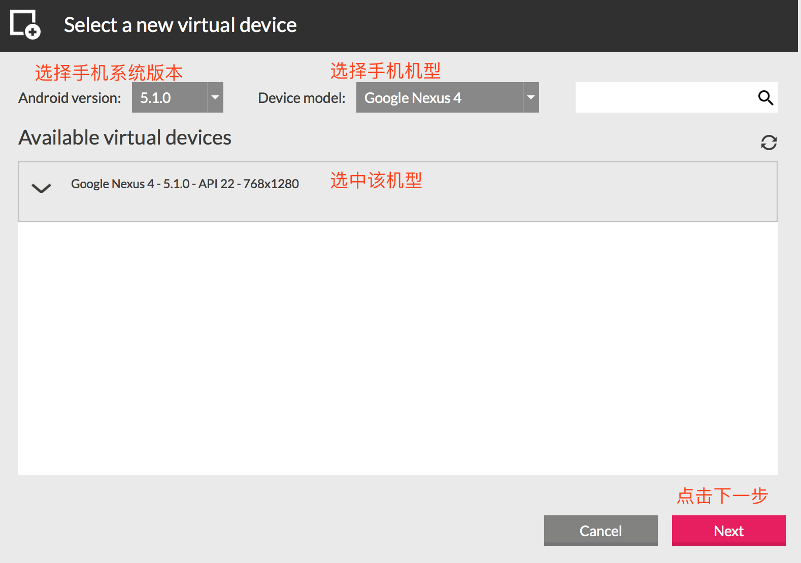


等待下载完成(下载时间根据网络)


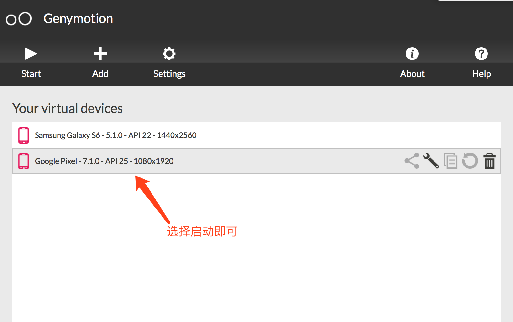

## 03.包名和启动名

### 03.1 包名

决定程序的唯一性（不是应用的名字）

### 03.2 启动名

**目前可以理解**，一个启动名，对应着一个界面。

## 04.adb命令介绍

### 04.1 adb的含义

ADB全名Andorid Debug Bridge。 是一个Debug工具。为何称之为Bridge呢？因为adb是一个标准的C/S结构的工具, 是要连接开发电脑和调试手机的。包含如下几个部分:

```
1.Client端，运行在开发机器中，即你的开发PC机。用来发送adb命令。
2.Daemon守护进程, 运行在调试设备中, 即的调试手机或模拟器。
3.Server端, 作为一个后台进程运行在开发机器中, 即你的开发PC机. 用来管理PC中的Client端和手机的Daemon之间的通信。
```

### 04.2 adb常用命令

#### adb帮助

```
adb --help
```

#### 启动adb server

```
adb start-server
```

#### 关闭adb server

```
adb kill-server
```

#### 获取设备号

```
adb devices
```

#### 获取系统版本

```
adb -s 设备号 shell getprop ro.build.version.release
```

#### 发送文件到手机

```
adb push 电脑端文件路径/需要发送的文件  手机端存储的路径

示例：
	将桌面的xx.png发送到手机sdcard目录下
	adb push C:\Users\win\Desktop\xx.png  /sdcard
```

#### 从手机拉取文件

```
adb pull 手机端的路径/拉取文件名 电脑端存储文件路径

示例：
	将手机/sdcard目录中的xx.png文件，发送到电脑桌面
	adb pull /sdcard/xx.png C:\Users\win\Desktop
```

#### 查看手机运行日志

```
adb logcat
```

#### 手机shell命令行

```
adb shell
```

#### 获取app包名和启动名

手机需要先打开对应app

```
1.Mac/Linux: 'adb shell dumpsys window windows | grep mFocusedApp’
2.在 Windows 终端运行 'adb shell dumpsys window windows’ 然后去看mFocusedApp这一行的内容。
```

#### 安装app到手机

```
adb install 路径/xx.apk
```

#### 卸载手机手机app

```
adb uninstall 包名
```

#### 获取app启动时间

```
adb shell am start -W 包名/启动名

示例：
	adb shell am start -W com.yly.drawpic/.MainActivity
解释：
	ThisTime  该activity启动耗时
	TotalTime  应用自身启动耗时 = ThisTime + 应用application等资源启动时间
	WaitTime  系统启动应用耗时 = TotalTime + 系统资源启动时间
```

## 05.移动端自动化测试工具

### 05.1 主流的移动端自动化工具

- Robotium

​    1.支持语言：Java

​    2.仅支持Android系统

​    3.不支持跨应用

- Macaca

​    1.支持语言：Java，Python，Node.js

​    2.支持Android和iOS系统

​    3.支持跨应用

- Appium

​    1.支持语言：Java，C#，Python，php，perl，ruby，Node.js

​    2.支持Android和iOS系统

​    3.支持跨应用

- 自动化工具选择的关注点

​    1.是否支持native，webview

​    2.是否支持获取toast

​    3.是否支持跨应用

### 05.2 Appium介绍 

Appium是一个移动端的自动化框架，可用于测试原生应用，移动网页应用和混合型应用，且是跨平台的。可用于iOS和Android以及firefox的操作系统。原生的应用是指用android或ios的sdk编写的应用，移动网页应用是指网页应用，类似于ios中safari应用或者Chrome应用或者类浏览器的应用。混合应用是指一种包裹webview的应用,原生应用于网页内容交互性的应用。
重要的是Appium是跨平台的，何为跨平台，意思就是可以针对不同的平台用一套api来编写测试用例。

### 05.3 Appium特点

1.使用自动化来测试一个app，但是不需要重新编译它
2.写自动化case，不需要学习特定的语言
3.一个自动化框架不需要重复造轮子
4.一个自动化框架需要开源，在精神和实践上实现开源

### 05.4 Appium自动化测试环境搭建

我们使用Appium和python来进行自动化测试，需要安装两个东西，一个是Appium的客户端，一个是Appium-python库。这两个需要安装的东西在加上手机就可以进行自动化测试，它们之间的关系是：python代码 -> Appium-python库 -> Appium -> 手机。

#### Appium客户端安装

##### Appium背景介绍

```
1.官网：www.appium.io,由SauceLab公司开发

2.Appium是由nodejs的express框架写的Http Server,Appium使用WebDriver的json wire协议，来驱动Apple系统的UIAutomation库、Android系统的UIAutomator框架
```

##### Appium桌面客户端安装方式

```
1. 运行appium-desktop-Setup-1.2.7.exe，默认安装即可
2. 启动客户端，按图片步骤 1 -> 2 -> 3 -> 4 设置
```

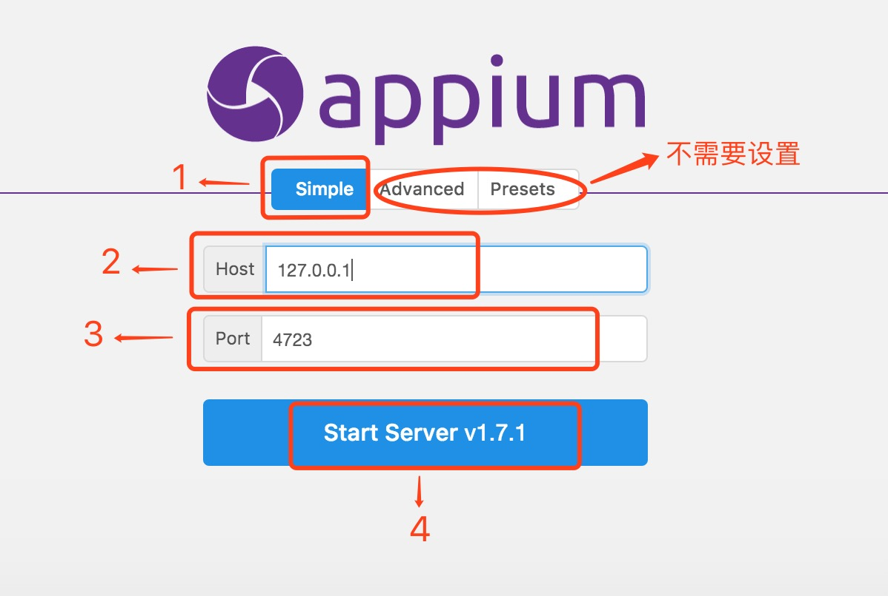

```
3. 启动成功展示如下图
```

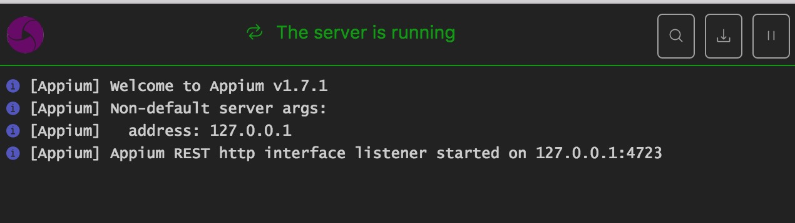

##### Appium命令行安装方式

```
1. 安装Node.js ->Win:官网下载可执行包安装(Linux: yum install; Macos: brew install)
2. 安装完成后 命令行运行npm或node -v 来查看是否安装成功
```

 

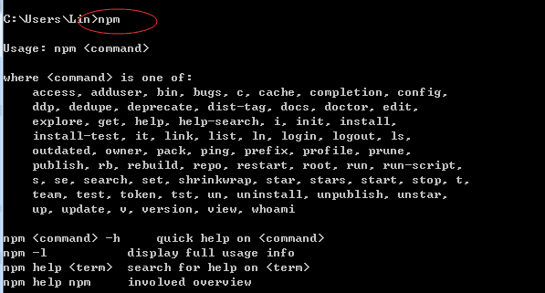

```
敲黑板: npm国内一般被墙，所以选择淘宝镜像安装，官网:http://npm.taobao.org
3. 安装cnpm: npm install -g cnpm --registry=https://registry.npm.taobao.org
```

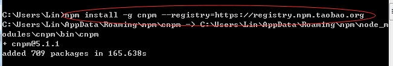

```
4. 安装appium: cnpm install -g appium
```

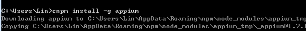 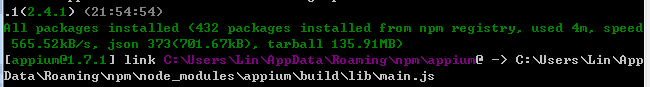

```
4. 启动appium服务命令: appium &，如下图即正确安装
敲黑板: Windows安装会提示os的模块错误，这个需要mac系统支持，不影响windows操作使用
```


#### Appium-python库安装

##### 命令行安装(需要联网)

```
pip3 install Appium-Python-Client
```

##### 安装包安装

```
前提：python已安装setuptools包
安装setuptools:
	1.解压setuptools-38.2.4.zip
	2.进入解压后文件夹执行命令: python setup.py install
	3.等待安装完成，无错误信息即可

安装Appium-Python-Client:
	1.解压Appium-Python-Client-0.25.tar.gz
	2.进入解压后文件夹执行命令: python setup.py install
	3.等待安装完成，无错误信息即可
```


## 06.Hello Appium 

### 需求

使用Python打开android模拟器中的设置界面。


### 思路

python代码到手机的过程是需要先经过Appium-python库再经过Appium再到手机。也就是python代码 -> Appium-python库 -> Appium -> 手机。

### 方法

```
  from appium import webdriver

  import time

  # server 启动参数
  desired_caps = {}
  # 设备信息
  desired_caps['platformName'] = 'Android'
  desired_caps['platformVersion'] = '5.1'
  desired_caps['deviceName'] = '192.168.56.101:5555'
  # app信息
  desired_caps['appPackage'] = 'com.android.settings'
  desired_caps['appActivity'] = '.Settings'

  driver = webdriver.Remote('http://localhost:4723/wd/hub', desired_caps)

  # time.sleep(2)

  # driver.quit()
```


## 07.Appium 基础API

### App基础操作API

#### 前置代码

```
  # server 启动参数

  desired_caps = {}
  desired_caps['platformName'] = 'Android' 
  desired_caps['platformVersion'] = '5.1'
  desired_caps['deviceName'] = '192.168.56.101:5555'
  desired_caps['appPackage'] = 'com.android.settings'
  desired_caps['appActivity'] = '.Settings'
  desired_caps['unicodeKeyboard'] = True
  desired_caps['resetKeyboard'] = True

  # 声明driver对象
  driver = webdriver.Remote('http://127.0.0.1:4723/wd/hub', desired_caps)

```

####获取app包名和启动名

```
	获取包名方法：current_package
	获取启动名：current_activity
```
```
	业务场景：
		1.启动设置
		2.获取包名和启动名
```
```
	代码实现：
		print(driver.current_package)
    	print(driver.current_activity)
    执行结果：
    	com.tencent.news
    	.activity.SplashActivity
```
#### 脚本内启动其他app

```
    driver.start_activity(appPackage,appActivity)
    参数：
    	appPackage：包名
    	appActivity：启动名
    示例：
    	driver.start_activity('com.android.mms', '.ui.ConversationList')
```

#### 关闭app

```
	driver.close_app()  # 关闭当前操作的app，不会关闭驱动对象
```

#### 关闭驱动对象

```
	driver.quit()   # 关闭驱动对象，同时关闭所有关联的app
```

#### 安装APK到手机

```
	driver.install_app(app_path) 
	参数：
		app_path：脚本机器中APK文件路径
	示例：
		driver.install_app("/Users/Yoson/Downloads/anzhishichang_6450.apk")
```

#### 手机中移除APP

```
	driver.remove_app(app_id) 
	参数：
		app_id：需要卸载的app包名
	示例：
		driver.remove_app('cn.goapk.market')
```

#### 判断APP是否已安装

```
	driver.is_app_installed(app_id) 
	参数：
		bundle_id: 可以传入app包名,返回结果为True(已安装) / False(未安装)
	示例：
	print(driver.is_app_installed('cn.goapk.market'))
```

#### 发送文件到手机

```
	import base64
	data = str(base64.b64encode(data.encode('utf-8')),'utf-8')
	driver.push_file(path,data)
	参数：
		path：手机设备上的路径(例如：/sdcard/a.txt)
		data：文件内数据,要求base64编码
		Python3.x中字符都为unicode编码，而b64encode函数的参数为byte类型，需要先转码；生成的数据为byte类型，需要将byte转换回去。
	示例：
		import base64
		data = str(base64.b64encode('test 123'.encode('utf-8')), 'utf-8')
		driver.push_file('/sdcard/test.txt', data)
```

#### 从手机中拉取文件

```
	import base64
	data = driver.pull_file(path) # 返回数据为base64编码
	print(str(base64.b64decode(data),'utf-8')) # base64解码
	参数：
		path: 手机设备上的路径
	示例：
		import base64
		data = driver.pull_file('/sdcard/test.txt') # 返回数据为base64编码
		print(str(base64.b64decode(data), 'utf-8')) # base64解码
```

#### 获取当前屏幕内元素结构

```
	driver.page_source  
	作用：
		返回当前页面的文档结构，判断特定的元素是否存在
	示例：
		print(driver.page_source)
```

####应用置于后台事件

```
	APP放置后台，模拟热启动
	方法：background_app(seconds)
	参数：
		1.seconds:停留在后台的时间，单位：秒
```
```
	业务场景：
		1.进入设置页
		2.将APP置于后台5s
```
```
	代码实现：
		driver.background_app(5)
	效果：
		app置于后台5s后，再次展示当前页面
```


## 08.UIAutomatorViewer

### 工具简介

用来扫描和分析Android应用程序的UI控件的工具.

### 如何使用

1.进入SDK目录下的tools目录，打开uiautomatorviewer

2.电脑连接真机或打开android模拟器

3.启动待测试app

4.点击uiautomatorviewer的左上角Device Screenshot,会生成app当前页面的UI控件截图


## 09.元素定位API

```
手工测试主要通过可见按钮操作，而自动化是通过元素进行交互操作.
⚠️⚠️⚠️ 元素的基本定位基于当前屏幕范围内展示的可见元素。
```
* Appium常用元素定位方式

| name  | value       |
| ----- | ----------- |
| id    | id属性值    |
| class | class属性值 |
| xpath | xpath表达式 |

* 前置代码

```
	from appium import webdriver
	# server 启动参数
	desired_caps = {}
	# 设备信息
	desired_caps['platformName'] = 'Android'
	desired_caps['platformVersion'] = '5.1'
	desired_caps['deviceName'] = '192.168.56.101:5555'
	# app的信息
	desired_caps['appPackage'] = 'com.android.settings'
	desired_caps['appActivity'] = '.Settings'

	# 声明我们的driver对象
	driver = webdriver.Remote('http://127.0.0.1:4723/wd/hub', desired_caps)
```

### 定位一个元素 element

#### 通过id定位

```
	方法：find_element_by_id(id_value) # id_value:为元素的id属性值
```
```
	业务场景:
		1.进入设置页面
		2.通过ID定位方式点击搜索按钮
```
```
	代码实现：
		driver.find_element_by_id("com.android.settings:id/search").click()
		driver.quit()
```

#### 通过class定位

```
	方法：find_element_by_class_name(class_value) # class_value:为元素的class属性值
```

```
	业务场景:
		1.进入设置页面
		2.点击搜索按钮
		3.通过class定位方式点击输入框的返回按钮
```
```
	代码实现：
		# id 点击搜索按钮
		driver.find_element_by_id("com.android.settings:id/search").click()
		# class 点击输入框返回按钮
		driver.find_element_by_class_name('android.widget.ImageButton').click()
		driver.quit()
```

#### 通过xpath定位

```
	方法：find_element_by_xpath(xpath_value) # xpath_value:为可以定位到元素的xpath语句
```
```
	*** android端xptah常用属性定位：
		1. id ://*[contains(@resource-id,'com.android.settings:id/search')] 
		2. class ://*[contains(@class,'android.widget.ImageButton')]
		3. text ://*[contains(@text,'WLA')]

	*** 模糊定位 contains(@key,value): value可以是部分值
```

```
	业务场景:
		1.进入设置页面
		2.点击WLAN菜单栏
```
```
	代码实现：
		# xpath 点击WLAN按钮
	    driver.find_element_by_xpath("//*[contains(@text,'WLA')]").click()
```

### 定位一组元素 elements

```
	应用场景为元素值重复，无法通过元素属性直接定位到某个元素，只能通过elements方式来选择，返回一个定位对象的列表.
```

#### 通过id方式定位一组元素

```
	方法： find_elements_by_id(id_value) # id_value:为元素的id属性值
```

```
	业务场景:
		1.进入设置页面
		2.点击WLAN菜单栏(id定位对象列表中第1个)
```

```
	代码实现：
		# 定位到一组元素
		title = driver.find_elements_by_id("com.android.settings:id/title")
		# 打印title类型，预期为list
    	print(type(title))
    	# 取title返回列表中的第一个定位对象，执行点击操作
    	title[0].click()
```

#### 通过class方式定位一组元素

```
	方法：find_elements_by_class_name(class_value) # class_value:为元素的class属性值
```

```
	业务场景:
		1.进入设置页面
		2.点击WLAN菜单栏(class定位对象列表中第3个)
```

```
	代码实现：
		# 定位到一组元素
		title = driver.find_elements_by_class_name("android.widget.TextView")
		# 打印title类型，预期为list
    	print(type(title))
    	# 取title返回列表中的第一个定位对象，执行点击操作
    	title[3].click()
```

#### 通过xpath方式定位一组元素

```
	方法:find_elements_by_xpath(xpath_value) # xpath_value:为可以定位到元素的xpath语句
```

```
	业务场景:
		1.进入设置页面
		2.点击WLAN菜单栏(xpath中class属性定位对象列表中第3个)
```

```
	代码实现：
		# 定位到一组元素
		title = driver.find_elements_by_xpath("//*[contains(@class,'widget.TextView')]")
		# 打印title类型，预期为list
    	print(type(title))
    	# 取title返回列表中的第一个定位对象，执行点击操作
    	title[3].click()
```
### WebDriverWait 显示等待 

```
	在一个超时时间范围内，每隔一段时间去搜索一次元素是否存在，
	如果存在返回定位对象，如果不存在直到超时时间到达，报超时异常错误。
```

```
	方法:WebDriverWait(driver, timeout, poll_frequency).until(method)
	参数：
		1.driver：手机驱动对象
		2.timeout：搜索超时时间
		3.poll_frequency：每次搜索间隔时间，默认时间为0.5s
		4.method：定位方法(匿名函数)
```

```
	匿名函数: 
		lambda x: x
	等价于python函数：
		def test(x):
    		return x
```

```
	使用示例：
		from selenium.webdriver.support.wait import WebDriverWait
		WebDriverWait(driver, timeout, poll_frequency).until(lambda x: x.find_elements_by_id(id_value))
	解释：
		1.x传入值为：driver，所以才可以使用定位方法.
	函数运行过程：
		1.实例化WebDriverWait类，传入driver对象，之后driver对象被赋值给WebDriverWait的一个类变量：self._driver
		2.until为WebDriverWait类的方法，until传入method方法(即匿名函数)，之后method方法会被传入self._driver
		3.搜索到元素后until返回定位对象，没有搜索到函数until返回超时异常错误.
```

```
	业务场景:
		1.进入设置页面
		2.通过ID定位方式点击搜索按钮
```

```
	代码实现：
		from selenium.webdriver.support.wait import WebDriverWait # 导入WebDriverWait类
		# 超时时间为30s，每隔1秒搜索一次元素是否存在，如果元素存在返回定位对象并退出
		search_button = WebDriverWait(driver, 30, 1).until(lambda x: x.find_elements_by_id(com.android.settings:id/search))
		search_button.click()
		driver.quit()
```
## 10.元素操作API

```
	本节讲介绍手机端元素信息的获取以及基本的输入操作。
```
* 前置代码

```
	from appium import webdriver
	# server 启动参数
	desired_caps = {}
	# 设备信息
	desired_caps['platformName'] = 'Android'
	desired_caps['platformVersion'] = '5.1'
	desired_caps['deviceName'] = '192.168.56.101:5555'
	# app的信息
	desired_caps['appPackage'] = 'com.android.settings'
	desired_caps['appActivity'] = '.Settings'

	# 声明我们的driver对象
	driver = webdriver.Remote('http://127.0.0.1:4723/wd/hub', desired_caps)
```
### 点击元素
```
	方法：click() 
```
```
	业务场景:
		1.打开设置
		2.点击搜索按钮
```

```
	代码实现：
		# 点击搜索按钮
    	driver.find_element_by_id("com.android.settings:id/search").click()
```
### 发送数据到输入框

```
	方法：send_keys(vaue) # value：需要发送到输入框内的文本
```
```
	业务场景:
		1.打开设置
		2.点击搜索按钮
		3.输入内容abc
```

```
	代码实现：
		# 点击搜索按钮
    	driver.find_element_by_id("com.android.settings:id/search").click()
    	# 定位到输入框并输入abc
    	driver.find_element_by_id("android:id/search_src_text").send_keys("abc")

    重点:
    	大家可以将输入的abc 改成 输入中文，得到的结果:输入框无任何值输入且程序不会抱错
```
```
	解决输入中文问题：

		1.server 启动参数增加两个参数配置
			desired_caps['unicodeKeyboard'] = True
			desired_caps['resetKeyboard'] = True

		2.再次运行会发现运行成功
			# 点击搜索按钮
	    	driver.find_element_by_id("com.android.settings:id/search").click()
	    	# 定位到输入框并输入abc
	    	driver.find_element_by_id("android:id/search_src_text").send_keys("传智播客")
```
### 清空输入框内容

```
	方法：clear()
```
```
	业务场景:
		1.打开设置
		2.点击搜索按钮
		3.输入内容abc
		4.删除已输入abc
```
```
	代码实现：
		# 点击搜索按钮
	    driver.find_element_by_id("com.android.settings:id/search").click()
	    # 定位到输入框并输入abc
	    input_text = driver.find_element_by_id("android:id/search_src_text")
	    # 输入abc
	    input_text.send_keys("abc")
	    time.sleep(1)
	    # 删除abc
	    input_text.clear()
```

### 获取元素的文本内容

```
	方法: text
```
```
	业务场景：
		1.进入设置
		2.获取所有元素class属性为“android.widget.TextView”的文本内容
```
```
	代码实现：
		text_vlaue = driver.find_elements_by_class_name("android.widget.TextView")
	    for i in text_vlaue:
	        print(i.text)
	执行结果：
		设置

		无线和网络
		WLAN
		更多
		设备
		显示
		提示音和通知
		存储
```
### 获取元素的属性值

```
	方法: get_attribute(value) # value:元素的属性
	⚠️ value='name' 返回content-desc / text属性值
	⚠️ value='text' 返回text的属性值
	⚠️ value='className' 返回 class属性值，只有 API=>18 才能支持
	⚠️ value='resourceId' 返回 resource-id属性值，只有 API=>18 才能支持
```
```
	业务场景：
		1.进入设置
		2.获取搜索按钮的content-desc属性值
```

```
	代码实现：
		# 定位到搜索按钮
		get_value = driver.find_element_by_id("com.android.settings:id/search")
    	print(get_value.get_attribute("name"))
    执行结果：
    	搜索
```
### 获取元素在屏幕上的坐标

```
	方法:location
```
```
	业务场景：
		1.进入设置页面
		2.获取搜索按钮在屏幕的坐标位置
```
```
	代码实现:
		# 定位到搜索按钮
	    get_value = driver.find_element_by_id("com.android.settings:id/search")
	    # 打印搜索按钮在屏幕上的坐标
	    print(get_value.location)
	执行结果:
		{'y': 44, 'x': 408}
```

## 11.滑动和拖拽事件

* 前置代码

```
	from appium import webdriver
	# server 启动参数
	desired_caps = {}
	# 设备信息
	desired_caps['platformName'] = 'Android'
	desired_caps['platformVersion'] = '5.1'
	desired_caps['deviceName'] = '192.168.56.101:5555'
	# app的信息
	desired_caps['appPackage'] = 'com.android.settings'
	desired_caps['appActivity'] = '.Settings'

	# 声明我们的driver对象
	driver = webdriver.Remote('http://127.0.0.1:4723/wd/hub', desired_caps)
```
### swip 滑动事件

```
	⚠️从一个坐标位置滑动到另一个坐标位置,只能是两个点之间的滑动
	方法：swipe(start_x, start_y, end_x, end_y, duration=None)
	参数：
		1.start_x：起点X轴坐标
		2.start_y：起点Y轴坐标
		3.end_x：  终点X轴坐标
		4.end_y,： 终点Y轴坐标
		5.duration： 滑动这个操作一共持续的时间长度，单位：ms
```
```
	业务场景：
		1.进入设置
		2.从坐标(148,659)滑动到坐标(148,248)
```
```
	代码实现：
		# 滑动没有持续时间
		driver.swipe(188,659,148,248)
		# 滑动持续5秒的时间
		driver.swipe(188,659,148,248,5000)
```

### scroll 滑动事件

```
	⚠️ 从一个元素滑动到另一个元素，直到页面自动停止
	方法：scroll(origin_el, destination_el)
	参数：
		1.origin_el：滑动开始的元素
		2.destination_el：滑动结束的元素
```
```
	业务场景：
		1.进入设置页
		2.模拟手指从存储菜单位置 到 WLAN菜单位置的上滑操作
```
```
	代码实现：
		# 定位到存储菜单栏
		el1 = driver.find_element_by_xpath("//*[contains(@text,'存储')]")
		# 定位到WLAN菜单栏
	    el2 = driver.find_element_by_xpath("//*[contains(@text,'WLAN')]")
	    # 执行滑动操作
	    driver.scroll(el1,el2)
```
### drag 拖拽事件

```
	⚠️ 从一个元素滑动到另一个元素,第二个元素替代第一个元素原本屏幕上的位置
	方法：drag_and_drop(origin_el, destination_el)
	参数：
		1.origin_el：滑动开始的元素
		2.destination_el：滑动结束的元素
```
```
	业务场景：
		1.进入设置页
		2.模拟手指将存储菜单 滑动到 WLAN菜单栏位置
```
```
	代码实现：
		# 定位到存储菜单栏
		el1 = driver.find_element_by_xpath("//*[contains(@text,'存储')]")
		# 定位到WLAN菜单栏
	    el2 = driver.find_element_by_xpath("//*[contains(@text,'WLAN')]")
	    # 执行滑动操作
	    driver.drag_and_drop(el1,el2)
```

## 12.高级手势TouchAction

```
	TouchAction是AppiumDriver的辅助类，主要针对手势操作，比如滑动、长按、拖动等，
	原理是将一系列的动作放在一个链条中发送到服务器，服务器接受到该链条后，解析各个动作，逐个执行。
```
⚠️ 所有手势都要通过执行perform()函数才会运行.

### 手指轻敲操作

```
	模拟手指轻敲一下屏幕操作
	方法：tap(element=None, x=None, y=None)
	方法：perform() # 发送命令到服务器执行操作
	参数：
		1.element：被定位到的元素
		2.x：相对于元素左上角的坐标，通常会使用元素的X轴坐标
		3.y：通常会使用元素的Y轴坐标
```
```
	业务场景：
		1.进入设置
		2.点击WLAN选项
```
```
	代码实现：
		# 通过元素定位方式敲击屏幕
	    el = driver.find_element_by_xpath("//*[contains(@text,'WLAN')]")
	    TouchAction(driver).tap(el).perform()

	    # 通过坐标方式敲击屏幕，WLAN坐标:x=155,y=250
	    # TouchAction(driver).tap(x=155,y=250).perform()
```

### 手指按操作

```
	模拟手指按下屏幕,按就要对应着离开.
```
```
	方法:press(el=None, x=None, y=None)
	方法：release() # 结束动作，手指离开屏幕
	参数：
		1.element：被定位到的元素
		2.x：通常会使用元素的X轴坐标
		3.y：通常会使用元素的Y轴坐标
```
```
	业务场景:
		1.进入设置
		2.点击WLAN选项
```
```
	代码实现：
		# 通过元素定位方式按下屏幕
	    el = driver.find_element_by_xpath("//*[contains(@text,'WLAN')]")
	    TouchAction(driver).press(el).release().perform()

	    # 通过坐标方式按下屏幕，WLAN坐标:x=155,y=250
	    # TouchAction(driver).tap(x=155,y=250).release().perform()
```
### 等待操作

```
	方法：wait(ms=0)
	参数：
		ms：暂停的毫秒数
```
```
	业务场景:
		1.进入设置
		2.点击WLAN选项
		3.长按WiredSSID选项5秒
```
```
	代码实现：
		# 点击WLAN
	    driver.find_element_by_xpath("//*[contains(@text,'WLAN')]").click()
	    # 定位到WiredSSID
	    el =driver.find_element_by_id("android:id/title")
	    # 通过元素定位方式长按元素
	    TouchAction(driver).press(el).wait(5000).perform()

	    # TouchAction(driver).press(x=171,y=245).wait(5000).release().perform() ⚠️ 该方法未能完成长按操作，没有报任何错误
```

### 手指长按操作

```
	模拟手机按下屏幕一段时间,按就要对应着离开.
```
```
	方法：long_press(el=None, x=None, y=None, duration=1000)
	参数：
		1.element：被定位到的元素
		2.x：通常会使用元素的X轴坐标
		3.y：通常会使用元素的Y轴坐标
		4.duration：持续时间，默认为1000ms
```
```
	业务场景:
		1.进入设置
		2.点击WLAN选项
		3.长按WiredSSID选项5秒
```
```
	代码实现：
		# 点击WLAN
	    driver.find_element_by_xpath("//*[contains(@text,'WLAN')]").click()
	    # 定位到WiredSSID
	    el =driver.find_element_by_id("android:id/title")
	    # 通过元素定位方式长按元素
	    TouchAction(driver).long_press(el,duration=5000).release().perform()

	    # 通过坐标方式长按元素，WLAN坐标:x=161,y=242
    	# TouchAction(driver).long_press(x=161,y=242).perform() # ⚠️ 通过这个方法定位时报服务端错误，怀疑是appium1.7.1版本bug
```
### 手指移动操作

```
	模拟手机的滑动操作
	方法：move_to(el=None, x=None, y=None)
	参数:
		1.el:定位的元素
		2.x:相对于前一个元素的X轴偏移量
		3.y:相对于前一个元素的Y轴偏移量
```
```
	业务场景：
		1.进入设置
		2.向上滑动屏幕
```

```
	代码实现：
    	# 定位到存储
	    el = driver.find_element_by_xpath("//*[contains(@text,'存储')]")
	    # 定位到更多
	    el1 = driver.find_element_by_xpath("//*[contains(@text,'更多')]")
	    # 元素方式滑动
	    TouchAction(driver).press(el).move_to(el1).release().perform()
	    # 坐标的方式滑动
	    # TouchAction(driver).press(x=240,y=600).wait(100).move_to(x=100,y=100).release().perform()

```
### 案例-手势解锁

```
	需求：
		1.进入设置
		2.向上滑动屏幕到可见"安全"选项
		3.进入到安全
		4.点击屏幕锁定方式
		5.点击图案
		6.绘制图案
```

```
	代码实现：
		# 定位到WLAN
	    el1 = driver.find_element_by_xpath("//*[contains(@text,'WLAN')]")
	    # 定位到存储
	    el2 = driver.find_element_by_xpath("//*[contains(@text,'存储')]")
	    # 存储上滑到WLAN
	    driver.drag_and_drop(el2,el1)
	    # 定位到用户
	    el3 = driver.find_element_by_xpath("//*[contains(@text,'用户')]")
	    # 注意 这次使用drag_and_drop方法，传入的"存储定位"仍使用其原始在屏幕上的位置，所以是由存储滑动到用户才可以上滑，否则需要重新"定位存储"
	    # 存储上滑倒用户位置
	    driver.drag_and_drop(el2,el3)
	    # 点击安全按钮
	    driver.find_element_by_xpath("//*[contains(@text,'安全')]").click()
	    # 点击屏幕锁定方式按钮
	    driver.find_element_by_xpath("//*[contains(@text,'屏幕锁定')]").click()
	    # 点击图案按钮
	    driver.find_element_by_xpath("//*[contains(@text,'图案')]").click()
	    # 绘制图案四个坐标 1:(80,256) 2:(240,256) 3:(240,418) 4:(400,418)
	    TouchAction(driver).press(x=80,y=256).wait(100).move_to(x=160,y=0).wait(100)\
	        .move_to(x=0,y=162).wait(100).move_to(x=160,y=0).release().perform()
```


## 13.手机操作API

```
	针对手机的一些常用设置功能进行操作.
```
### 获取手机时间

```
	方法：device_time
```
```
	代码实现：
		# 获取当前手机的时间
		print(driver.device_time)
	执行结果：
		Wed Dec 27 08:52:45 EST 2017
```
### 获取手机的宽高

```
	获取手机的宽高，可以根据宽高做一些坐标的操作
```
```
	方法：get_window_size()
```
```
	代码实现：
		print(driver.get_window_size())
	执行结果：
		{'height': 800, 'width': 480}
```
### 发送键到设备

```
	模拟系统键值的操作，比如操作honme键，音量键,返回键等。
```
```
	方法：keyevent(keycode, metastate=None):
	参数：
		keycode：发送给设备的关键代码
		metastate：关于被发送的关键代码的元信息，一般为默认值
```
```
	业务场景:
		1.打开设置
		2.按多次音量增加键
```
```
	代码实现：
		for i in range(3):
        	driver.keyevent(24)
```

### 操作手机通知栏

```
	打开手机的通知栏，可以获取通知栏的相关信息和元素操作
```
```
	方法：open_notifications()
```
```
	业务场景: 
		1.启动设置
		2.打开通知栏
```
```
	代码实现：
		driver.open_notifications()
```

### 获取手机当前网络

```
	获取手机当前连接的网络
```
```
	方法：network_connection
```
```
	业务场景:
		获取手机当前网络模式
```
```
	代码实现：
		print(driver.network_connection)
	执行结果：
		6
```

### 设置手机网络

```
	更改手机的网络模式，模拟特殊网络情况下的测试用例
```
```
	方法：set_network_connection(connectionType)
	参数：
		connectionType：需要被设置成为的网络类型
```
```
	业务场景：
		1.启动设置
		2.设置手机网络为飞行模式
```
```
	代码实现：
		driver.set_network_connection(1)
```

### 手机截图

```
	截取手机当前屏幕，保存指定格式图片到设定位置
```
```
	方法：get_screenshot_as_file(filename)
	参数：
		filename：指定路径下，指定格式的图片.
```
```
	业务场景：
		1.打开设置页面
		2.截图当前页面保存到当前目录，命名为screen.png
```
```
	代码实现：
		import os
	    driver.get_screenshot_as_file(os.getcwd() + os.sep + './screen.png')
	执行结果：
		当前目录下会生成screen.png文件
```
## 14.Pytest安装和介绍

- 介绍

```
	pytest是python的一种单元测试框架，同自带的Unittest测试框架类似，相比于Unittest框架使用起来更简洁，效率更高。
```
- 特点:

```
	1.非常容易上手，入门简单，文档丰富，文档中有很多实例可以参考
	2.支持简单的单元测试和复杂的功能测试
	3.支持参数化
	4.执行测试过程中可以将某些测试跳过，或者对某些预期失败的Case标记成失败
	5.支持重复执行失败的Case
	6.支持运行由Nose , Unittest编写的测试Case
	7.具有很多第三方插件，并且可以自定义扩展
	8.方便的和持续集成工具集成
```
### Pytest安装

```
	1.mac／linux：sudo pip3 install -U pytest # -U:可以理解为--upgrade，表示已安装就升级为最新版本
	2.管理员方式运行cmd：pip3 install -U pytest
```
### Pytest安装成功校验

```
	1.进入命令行
	2.运行：pytest --version # 会展示当前已安装版本
```
## 15.Pytest基本使用

### Hello Pytest

```
	# file_name: test_abc.py
	import pytest # 引入pytest包
	def test_a(): # test开头的测试函数
	    print("------->test_a")
	    assert 1 # 断言成功
	def test_b():
	    print("------->test_b")
	    assert 0 # 断言失败
	if __name__ == '__main__':
	    pytest.main("-s  test_abc.py") # 调用pytest的main函数执行测试

```
```
	执行结果：
		test_abc.py 
		------->test_a
		. # .(代表成功)
		------->test_b
		F # F(代表失败)
```
### Pytest运行方式

* 1.测试类主函数模式

```
	pytest.main("-s  test_abc.py")
```
* 2.命令行模式

```
	pytest 文件路径／测试文件名
	例如：
		pytest ./test_abc.py
```
## 16.setup和teardown函数

* 概述
```
	1.setup和teardown主要分为：函数级、类级、模块级、功能级。
	2.存在于测试类内部
```
### 函数级别

```
	运行于测试方法的始末，即:运行一次测试函数会运行一次setup和teardown
```
```
	代码示例：
		import pytest
		class TestABC:
			# 函数级开始
		    def setup(self):
		        print("------->setup_method")
		    # 函数级结束
		    def teardown(self):
		        print("------->teardown_method")
		    def test_a(self):
		        print("------->test_a")
		        assert 1
		    def test_b(self):
		        print("------->test_b")
		if __name__ == '__main__':
		    pytest.main("-s  test_abc.py")
```
```
	执行结果：
		test_abc.py 
		------->setup_method # 第一次 setup()
		------->test_a
		.
		------->teardown_method # 第一次 teardown()
		------->setup_method # 第二次 setup()
		------->test_b
		.
		------->teardown_method # 第二次 teardown()
```
### 类级别

```
	运行于测试类的始末，即:在一个测试内只运行一次setup_class和teardown_class，不关心测试类内有多少个测试函数。
```
```
	代码示例：
		import pytest
		class TestABC:
			# 测试类级开始
		    def setup_class(self):
		        print("------->setup_class")
		    # 测试类级结束
		    def teardown_class(self):
		        print("------->teardown_class")
		    def test_a(self):
		        print("------->test_a")
		        assert 1
		    def test_b(self):
		        print("------->test_b")
		if __name__ == '__main__':
		    pytest.main("-s  test_abc.py")
```
```
	执行结果：
		test_abc.py 
		------->setup_class # 第一次 setup_class()
		------->test_a
		.
		------->test_b
		F 
		------->teardown_class # 第一次 teardown_class()
```
## 17.Pytest配置文件

```
	pytest的配置文件通常放在测试目录下，名称为pytest.ini，命令行运行时会使用该配置文件中的配置.
```
### 配置pytest命令行运行参数

```
	[pytest]
	addopts = -s ... # 空格分隔，可添加多个命令行参数 -所有参数均为插件包的参数
```
### 配置测试搜索的路径

```
	[pytest]
	testpaths = ./scripts  # 当前目录下的scripts文件夹 -可自定义
```
### 配置测试搜索的文件名

```
	[pytest]
	python_files = test_*.py  
	# 当前目录下的scripts文件夹下，以test_开头，以.py结尾的所有文件 -可自定义
```
### 配置测试搜索的测试类名

```
	[pytest]
	python_classes = Test*  
	# 当前目录下的scripts文件夹下，以test_开头，以.py结尾的所有文件中，以Test_开头的类 -可自定义
```
### 配置测试搜索的测试函数名

```
	[pytest]
	python_functions = test_*  
	# 当前目录下的scripts文件夹下，以test_开头，以.py结尾的所有文件中，以Test_开头的类内，以test_开头的方法 -可自定义
```
## 18.Pytest常用插件

```
	插件列表网址：https://plugincompat.herokuapp.com
	包含很多插件包，大家可依据工作的需求选择使用。
```
```
	前置条件：
		1.文件路径：
			- Test_App
			- - test_abc.py
			- - pytest.ini
		2.pyetst.ini配置文件内容：
			[pytest]
			# 命令行参数
			addopts = -s
			# 搜索文件名
			python_files = test_*.py
			# 搜索的类名
			python_classes = Test*
			# 搜索的函数名
			python_functions = test_*
```
### Pytest测试报告

```
	通过命令行方式，生成xml/html格式的测试报告，存储于用户指定路径。
```

```
	插件名称：pytest-html
	安装方式：
		1.安装包方式 python setup.py install 
		2.命令行 pip3 install pytest-html
	使用方法：
		命令行格式：pytest --html=用户路径/report.html
```
```
	示例：
		import pytest
		class TestABC:
			def setup_class(self):
				print("------->setup_class")
			def teardown_class(self):
				print("------->teardown_class")
			def test_a(self):
				print("------->test_a")
				assert 1
			def test_b(self):
				print("------->test_b")
				assert 0 # 断言失败
	运行方式：
		1.修改Test_App/pytest.ini文件，添加报告参数，即：addopts = -s --html=./report.html 
			# -s:输出程序运行信息
			# --html=./report.html 在当前目录下生成report.html文件
			⚠️ 若要生成xml文件，可将--html=./report.html 改成 --html=./report.xml
		2.命令行进入Test_App目录
		3.执行命令： pytest
	执行结果：
		1.在当前目录会生成assets文件夹和report.html文件
```


### Pytest控制函数执行顺序

```
	函数修饰符的方式标记被测试函数执行的顺序.
```

```
	插件名称：pytest-ordering
	安装方式：
		1.安装包方式 python setup.py install 
		2.命令行 pip3 install pytest-ordering
	使用方法：
		1.标记于被测试函数，@pytest.mark.run(order=x)
		2.根据order传入的参数来解决运行顺序
		3.order值全为正数或全为负数时，运行顺序：值越小，优先级越高
		4.正数和负数同时存在：正数优先级高
```

```
	默认情况下，pytest是根据测试方法名由小到大执行的,可以通过第三方插件包改变其运行顺序。
```
```
	默认执行方式
	示例：
		import pytest
		class TestABC:
		    def setup_class(self):
		        print("------->setup_class")
		    def teardown_class(self):
		        print("------->teardown_class")
		    def test_a(self):
		        print("------->test_a")
		        assert 1
		    def test_b(self):
		        print("------->test_b")
		        assert 0
		if __name__ == '__main__':
		    pytest.main("-s  test_abc.py")
	执行结果：
		test_abc.py 
		------->setup_class
		------->test_a # 默认第一个运行
		.
		------->test_b # 默认第二个运行
		F
		------->teardown_class
```

```
	示例：
		import pytest
		class TestABC:
			def setup_class(self):
				print("------->setup_class")

			def teardown_class(self):
				print("------->teardown_class")
			@pytest.mark.run(order=2)
			def test_a(self):
				print("------->test_a")
				assert 1

			@pytest.mark.run(order=1)
			def test_b(self):
				print("------->test_b")
				assert 0
		if __name__ == '__main__':
				pytest.main("-s  test_abc.py")
	执行结果：
		test_abc.py
		------->setup_class
		------->test_b # order=1 优先运行
		F
		------->test_a # order=2 晚于 order=1 运行
		.
		------->teardown_class

```
### Pytest失败重试

```
	通过命令行方式，控制失败函数的重试次数。
```

```
	插件名称：pytest-rerunfailures
	安装方式：
		1.安装包方式 python setup.py install 
		2.命令行 pip3 install pytest-rerunfailures
	使用方法：
		命令行格式：pytest --reruns n # n：为重试的次数
```
```
	示例：
	import pytest
	class Test_ABC:
		def setup_class(self):
			print("------->setup_class")
		def teardown_class(self):
			print("------->teardown_class")
		def test_a(self):
			print("------->test_a")
			assert 1
		def test_b(self):
			print("------->test_b")
			assert 0 # 断言失败
	运行方式：
		1.修改Test_App/pytest.ini文件，添加失败重试参数，即：addopts = -s  --reruns 2 --html=./report.html 
			# -s:输出程序运行信息
			# --reruns 2 ：失败测试函数重试两次
			# --html=./report.html 在当前目录下生成report.html文件
		2.命令行进入Test_App目录
		3.执行命令： pytest
	执行结果：
		1.在测试报告中可以看到两次重试记录
```


## 19.Pytest-fixture

```
	fixture修饰器来标记固定的工厂函数,在其他函数，模块，类或整个工程调用它时会被激活并优先执行,
		通常会被用于完成预置处理和重复操作。
```
```
	方法：fixture(scope="function", params=None, autouse=False, ids=None, name=None)
	常用参数:
		scope：被标记方法的作用域
			function" (default)：作用于每个测试方法，每个test都运行一次
			"class"：作用于整个类，每个class的所有test只运行一次
			"module"：作用于整个模块，每个module的所有test只运行一次
			"session：作用于整个session(慎用)，每个session只运行一次
		params：(list类型)提供参数数据，供调用标记方法的函数使用
		autouse：是否自动运行,默认为False不运行，设置为True自动运行
```
### fixture(通过参数引用)

```
	示例：
		import pytest
		class TestABC:
		    @pytest.fixture()
		    def before(self):
		        print("------->before")
		    def test_a(self,before): # ⚠️ test_a方法传入了被fixture标识的函数，已变量的形式
		        print("------->test_a")
		        assert 1
		if __name__ == '__main__':
		    pytest.main("-s  test_abc.py")
```
```
	执行结果：
		test_abc.py 
		------->before # 发现before会优先于测试函数运行
		------->test_a
		.  
```
### fixture(通过函数引用)

```
	示例：
		import pytest
		@pytest.fixture() # fixture标记的函数可以应用于测试类外部
		def before():
		    print("------->before")
		@pytest.mark.usefixtures("before")
		class TestABC:
		    def setup(self):
		        print("------->setup")
		    def test_a(self):
		        print("------->test_a")
		        assert 1
		if __name__ == '__main__':
		    pytest.main("-s  test_abc.py")
```
```
	执行结果：
		test_abc.py 
		------->before # 发现before会优先于测试类运行
		------->setup
		------->test_a
		.
```
### fixture(默认设置为运行)

```
	示例：
		import pytest
		@pytest.fixture(autouse=True) # 设置为默认运行
		def before():
		    print("------->before")
		class TestABC:
		    def setup(self):
		        print("------->setup")
		    def test_a(self):
		        print("------->test_a")
		        assert 1
		if __name__ == '__main__':
		    pytest.main("-s  test_abc.py")
```
```
	执行结果：
		test_abc.py 
		------->before # 发现before自动优先于测试类运行
		------->setup
		------->test_a
		.
```
### fixture(作用域为function)

```
	示例：
		import pytest
		@pytest.fixture(scope='function',autouse=True) # 作用域设置为function，自动运行
		def before():
		    print("------->before")
		class TestABC:
		    def setup(self):
		        print("------->setup")
		    def test_a(self):
		        print("------->test_a")
		        assert 1
		    def test_b(self):
		        print("------->test_b")
		        assert 1
		if __name__ == '__main__':
		    pytest.main("-s  test_abc.py")
```
```
	执行结果：
		test_abc.py
		------->before # 运行第一次
		------->setup
		------->test_a
		.------->before # 运行第二次
		------->setup
		------->test_b
		.
```
### fixture(作用域为class)

```
	示例：
		import pytest
		@pytest.fixture(scope='class',autouse=True) # 作用域设置为class，自动运行
		def before():
		    print("------->before")
		class TestABC:
		    def setup(self):
		        print("------->setup")
		    def test_a(self):
		        print("------->test_a")
		        assert 1
		    def test_b(self):
		        print("------->test_b")
		        assert 1
		if __name__ == '__main__':
		    pytest.main("-s  test_abc.py")
```
```
	执行结果：
		test_abc.py
		------->before # 发现只运行一次
		------->setup
		------->test_a
		.
		------->setup
		------->test_b
		.
```
### fixture(返回值)

```
	示例一:
		import pytest
		@pytest.fixture()
		def need_data():
		    return 2 # 返回数字2

		class TestABC:
		    def test_a(self,need_data):
		        print("------->test_a")
		        assert need_data != 3 # 拿到返回值做一次断言

		if __name__ == '__main__':
		    pytest.main("-s  test_abc.py")
	执行结果：
		test_abc.py 
		------->test_a
		.  
```
```
	示例二:
		import pytest
		@pytest.fixture(params=[1, 2, 3])
		def need_data(request): # 传入参数request 系统封装参数
		    return request.param # 取列表中单个值，默认的取值方式

		class TestABC:

		    def test_a(self,need_data):
		        print("------->test_a")
		        assert need_data != 3 # 断言need_data不等于3

		if __name__ == '__main__':
		    pytest.main("-s  test_abc.py")
	执行结果：
		# 可以发现结果运行了三次
		test_abc.py 
		1
		------->test_a
		.
		2
		------->test_a
		.
		3
		------->test_a
		F 
```

## 20.Pytest高阶用法

### 跳过测试函数

```
	根据特定的条件，不执行标识的测试函数.
```

```
	方法：
		skipif(condition, reason=None)
	参数：
		condition：跳过的条件，必传参数
		reason：标注原因，必传参数
	使用方法：
		@pytest.mark.skipif(condition, reason="xxx")
```
```
	示例：
		import pytest
		class TestABC:
			def setup_class(self):
				print("------->setup_class")
			def teardown_class(self):
				print("------->teardown_class")
			def test_a(self):
				print("------->test_a")
				assert 1
			@pytest.mark.skipif(condition=2>1,reason = "跳过该函数") # 跳过测试函数test_b
			def test_b(self):
				print("------->test_b")
				assert 0
	执行结果：
		test_abc.py 
		------->setup_class
		------->test_a #只执行了函数test_a
		.
		------->teardown_class
		s # 跳过函数
```
### 标记为预期失败函数

```
	标记测试函数为失败函数
```
```
	方法：
		xfail(condition=None, reason=None, raises=None, run=True, strict=False)
	常用参数：
		condition：预期失败的条件，必传参数
		reason：失败的原因，必传参数
	使用方法：
		@pytest.mark.xfail(condition, reason="xx")
```
```
	示例：
		import pytest
		class TestABC:
			def setup_class(self):
				print("------->setup_class")
			def teardown_class(self):
				print("------->teardown_class")
			def test_a(self):
				print("------->test_a")
				assert 1
			@pytest.mark.xfail(2 > 1, reason="标注为预期失败") # 标记为预期失败函数test_b
			def test_b(self):
				print("------->test_b")
				assert 0
	执行结果：
		test_abc.py 
		------->setup_class
		------->test_a
		.
		------->test_b
		------->teardown_class
		x  # 失败标记
```
### 函数数据参数化

```
	方便测试函数对测试属于的获取。
```
```
	方法：
		parametrize(argnames, argvalues, indirect=False, ids=None, scope=None)
	常用参数：
		argnames：参数名
		argvalues：参数对应值，类型必须为list
					当参数为一个时格式：[value]
					当参数个数大于一个时，格式为:[(param_value1,param_value2.....),(param_value1,param_value2.....)]
	使用方法:
		@pytest.mark.parametrize(argnames,argvalues)
		⚠️ 参数值为N个，测试方法就会运行N次
```
```
	单个参数示例：
		import pytest
		class TestABC:
			def setup_class(self):
				print("------->setup_class")
			def teardown_class(self):
				print("------->teardown_class")

			@pytest.mark.parametrize("a",[3,6]) # a参数被赋予两个值，函数会运行两遍
			def test_a(self,a): # 参数必须和parametrize里面的参数一致
				print("test data:a=%d"%a)
				assert a%3 == 0
	执行结果:
		test_abc.py 
		------->setup_class
		test data:a=3 # 运行第一次取值a=3
		.
		test data:a=6 # 运行第二次取值a=6
		. 
		------->teardown_class
```
```
	多个参数示例：
		import pytest
		class TestABC:
			def setup_class(self):
				print("------->setup_class")
			def teardown_class(self):
				print("------->teardown_class")

			@pytest.mark.parametrize("a,b",[(1,2),(0,3)]) # 参数a,b均被赋予两个值，函数会运行两遍
			def test_a(self,a,b): # 参数必须和parametrize里面的参数一致
				print("test data:a=%d,b=%d"%(a,b))
				assert a+b == 3
	执行结果：
		test_abc.py 
		------->setup_class
		test data:a=1,b=2 # 运行第一次取值 a=1,b=2
		.
		test data:a=0,b=3 # 运行第二次取值 a=0,b=3
		.
		------->teardown_class
```
```
	函数返回值类型示例：
		import pytest
		def return_test_data():
			return [(1,2),(0,3)]
		class TestABC:
			def setup_class(self):
				print("------->setup_class")
			def teardown_class(self):
				print("------->teardown_class")

			@pytest.mark.parametrize("a,b",return_test_data()) # 使用函数返回值的形式传入参数值
			def test_a(self,a,b):
				print("test data:a=%d,b=%d"%(a,b))
				assert a+b == 3
	执行结果：
		test_abc.py 
		------->setup_class
		test data:a=1,b=2 # 运行第一次取值 a=1,b=2
		.
		test data:a=0,b=3 # 运行第二次取值 a=0,b=3
		.
		------->teardown_class
```
## 小作业

### 元素定位和操作练习

- 点击搜索按钮
- 输入“无线”
- 获取当前有几条记录?

###滑动和拖拽时间练习

- 想办法滑动到最后的“关于手机”
- 点击进去
- 看当前页面是不是有一个“5.1”的字符串

## 常用代码

### 前置代码

```
	from appium import webdriver
	# server 启动参数
	desired_caps = {}
	# 设备信息
	desired_caps['platformName'] = 'Android'
	desired_caps['platformVersion'] = '5.1'
	desired_caps['deviceName'] = '192.168.56.101:5555'
	# app的信息
	desired_caps['appPackage'] = 'com.android.settings'
	desired_caps['appActivity'] = '.Settings'
	# 解决输入中文
	desired_caps['unicodeKeyboard'] = True
	desired_caps['resetKeyboard'] = True

	# 声明我们的driver对象
	driver = webdriver.Remote('http://127.0.0.1:4723/wd/hub', desired_caps)
```

### 获取包名

```
1.Mac/Linux: 'adb shell dumpsys window windows | grep mFocusedApp’
2.在 Windows 终端运行 'adb shell dumpsys window windows’ 然后去看mFocusedApp这一行的内容。
```

### xPath

```
//*[contains(@,'')]
```


