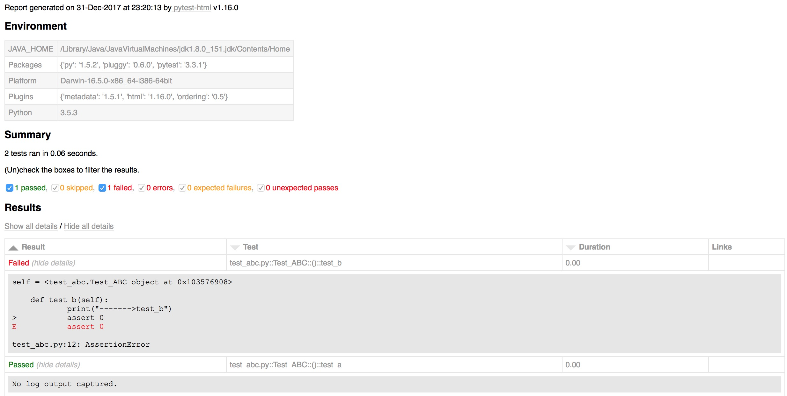
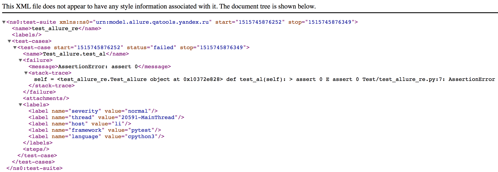
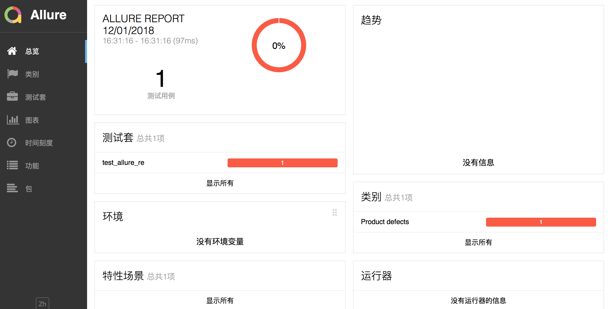
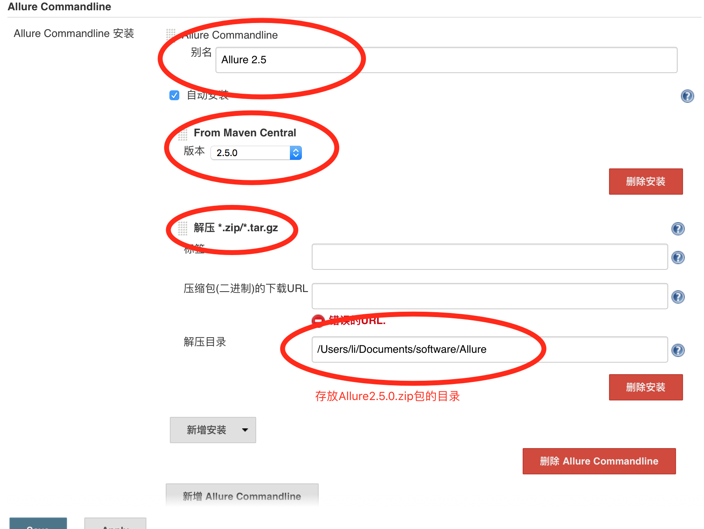
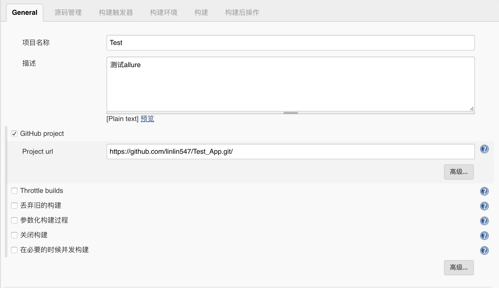
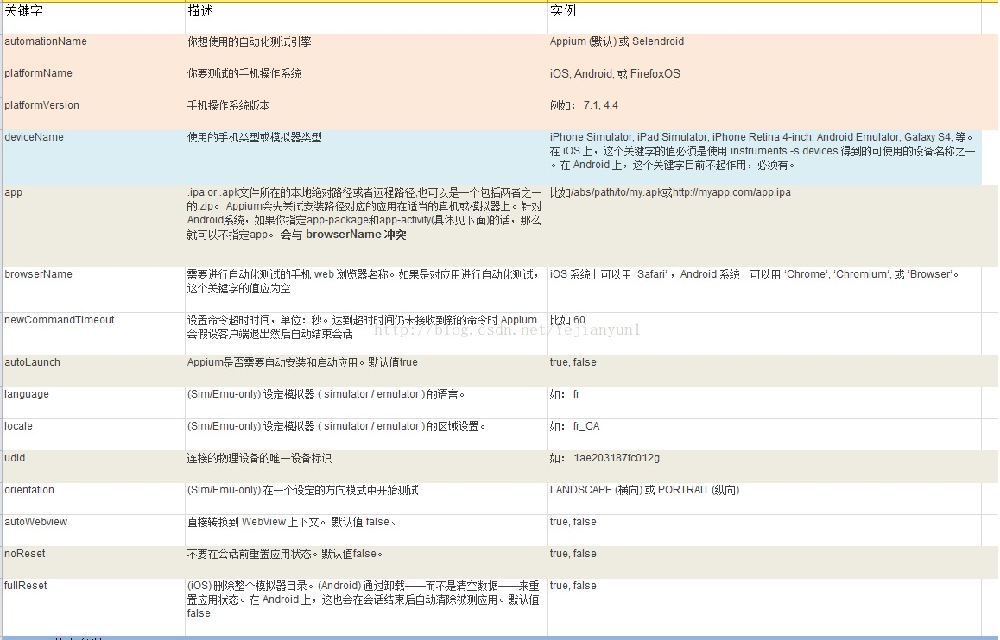
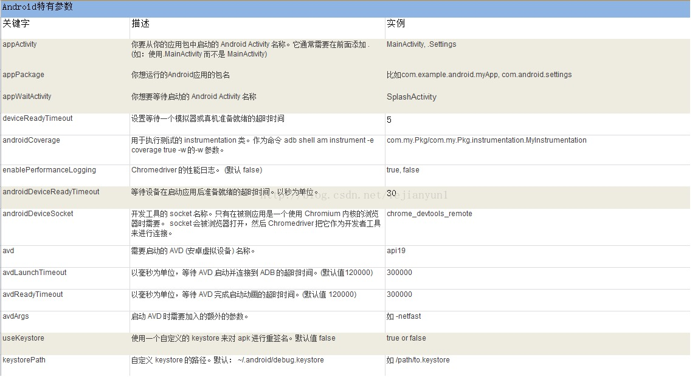
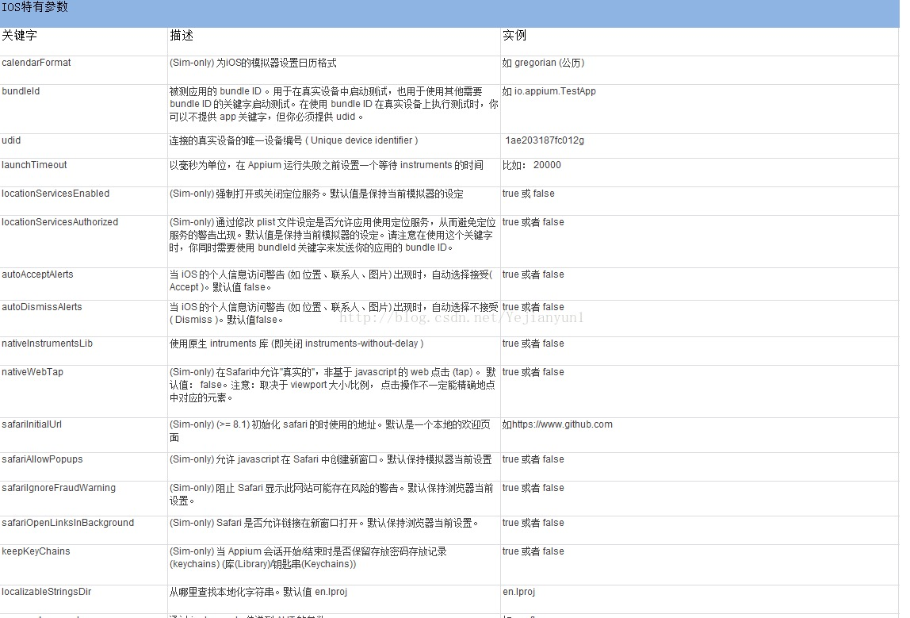

##  17.Pytest配置文件

```
	pytest的配置文件通常放在测试目录下，名称为pytest.ini，命令行运行时会使用该配置文件中的配置.
```

### 配置pytest命令行运行参数

```
	[pytest]
	addopts = -s ... # 空格分隔，可添加多个命令行参数 -所有参数均为插件包的参数
```

### 配置测试搜索的路径

```
	[pytest]
	testpaths = ./scripts  # 当前目录下的scripts文件夹 -可自定义
```

### 配置测试搜索的文件名

```
	[pytest]
	python_files = test_*.py  
	# 当前目录下的scripts文件夹下，以test_开头，以.py结尾的所有文件 -可自定义
```

### 配置测试搜索的测试类名

```
	[pytest]
	python_classes = Test*  
	# 当前目录下的scripts文件夹下，以test_开头，以.py结尾的所有文件中，以Test_开头的类 -可自定义
```

### 配置测试搜索的测试函数名

```
	[pytest]
	        
	# 当前目录下的scripts文件夹下，以test_开头，以.py结尾的所有文件中，以Test_开头的类内，以test_开头的方法 -可自定义

```

## 18.Pytest常用插件

```
	插件列表网址：https://plugincompat.herokuapp.com
	包含很多插件包，大家可依据工作的需求选择使用。

```

```
	前置条件：
		1.文件路径：
			- Test_App
			- - test_abc.py
			- - pytest.ini
		2.pyetst.ini配置文件内容：
			[pytest]
			# 命令行参数
			addopts = -s
			# 搜索文件名
			python_files = test_*.py
			# 搜索的类名
			python_classes = Test*
			# 搜索的函数名
			python_functions = test_*

```

### Pytest测试报告

```
	通过命令行方式，生成xml/html格式的测试报告，存储于用户指定路径。

```

```
	插件名称：pytest-html
	安装方式：
		1.安装包方式 python setup.py install 
		2.命令行 pip3 install pytest-html
	使用方法：
		命令行格式：pytest --html=用户路径/report.html

```

```
	示例：
		import pytest
		class TestABC:
			def setup_class(self):
				print("------->setup_class")
			def teardown_class(self):
				print("------->teardown_class")
			def test_a(self):
				print("------->test_a")
				assert 1
			def test_b(self):
				print("------->test_b")
				assert 0 # 断言失败
	运行方式：
		1.修改Test_App/pytest.ini文件，添加报告参数，即：addopts = -s --html=./report.html 
			# -s:输出程序运行信息
			# --html=./report.html 在当前目录下生成report.html文件
			⚠️ 若要生成xml文件，可将--html=./report.html 改成 --html=./report.xml
		2.命令行进入Test_App目录
		3.执行命令： pytest
	执行结果：
		1.在当前目录会生成assets文件夹和report.html文件

```



### Pytest控制函数执行顺序

```
	函数修饰符的方式标记被测试函数执行的顺序.

```

```
	插件名称：pytest-ordering
	安装方式：
		1.安装包方式 python setup.py install 
		2.命令行 pip3 install pytest-ordering
	使用方法：
		1.标记于被测试函数，@pytest.mark.run(order=x)
		2.根据order传入的参数来解决运行顺序
		3.order值全为正数或全为负数时，运行顺序：值越小，优先级越高
		4.正数和负数同时存在：正数优先级高

```

```
	默认情况下，pytest是根据测试方法名由小到大执行的,可以通过第三方插件包改变其运行顺序。

```

```
	默认执行方式
	示例：
		import pytest
		class TestABC:
		    def setup_class(self):
		        print("------->setup_class")
		    def teardown_class(self):
		        print("------->teardown_class")
		    def test_a(self):
		        print("------->test_a")
		        assert 1
		    def test_b(self):
		        print("------->test_b")
		        assert 0
		if __name__ == '__main__':
		    pytest.main("-s  test_abc.py")
	执行结果：
		test_abc.py 
		------->setup_class
		------->test_a # 默认第一个运行
		.
		------->test_b # 默认第二个运行
		F
		------->teardown_class

```

```
	示例：
		import pytest
		class TestABC:
			def setup_class(self):
				print("------->setup_class")

			def teardown_class(self):
				print("------->teardown_class")
			@pytest.mark.run(order=2)
			def test_a(self):
				print("------->test_a")
				assert 1

			@pytest.mark.run(order=1)
			def test_b(self):
				print("------->test_b")
				assert 0
		if __name__ == '__main__':
				pytest.main("-s  test_abc.py")
	执行结果：
		test_abc.py
		------->setup_class
		------->test_b # order=1 优先运行
		F
		------->test_a # order=2 晚于 order=1 运行
		.
		------->teardown_class


```

### Pytest失败重试

```
	通过命令行方式，控制失败函数的重试次数。

```

```
	插件名称：pytest-rerunfailures
	安装方式：
		1.安装包方式 python setup.py install 
		2.命令行 pip3 install pytest-rerunfailures
	使用方法：
		命令行格式：pytest --reruns n # n：为重试的次数

```

```
	示例：
	import pytest
	class Test_ABC:
		def setup_class(self):
			print("------->setup_class")
		def teardown_class(self):
			print("------->teardown_class")
		def test_a(self):
			print("------->test_a")
			assert 1
		def test_b(self):
			print("------->test_b")
			assert 0 # 断言失败
	运行方式：
		1.修改Test_App/pytest.ini文件，添加失败重试参数，即：addopts = -s  --reruns 2 --html=./report.html 
			# -s:输出程序运行信息
			# --reruns 2 ：失败测试函数重试两次
			# --html=./report.html 在当前目录下生成report.html文件
		2.命令行进入Test_App目录
		3.执行命令： pytest
	执行结果：
		1.在测试报告中可以看到两次重试记录

```


## 19.Pytest高阶用法

### 跳过测试函数

```
	根据特定的条件，不执行标识的测试函数.

```

```
	方法：
		skipif(condition, reason=None)
	参数：
		condition：跳过的条件，必传参数
		reason：标注原因，必传参数
	使用方法：
		@pytest.mark.skipif(condition, reason="xxx")

```

```
	示例：
		import pytest
		class TestABC:
			def setup_class(self):
				print("------->setup_class")
			def teardown_class(self):
				print("------->teardown_class")
			def test_a(self):
				print("------->test_a")
				assert 1
			@pytest.mark.skipif(condition=2>1,reason = "跳过该函数") # 跳过测试函数test_b
			def test_b(self):
				print("------->test_b")
				assert 0
	执行结果：
		test_abc.py 
		------->setup_class
		------->test_a #只执行了函数test_a
		.
		------->teardown_class
		s # 跳过函数


```

### 标记为预期失败函数

```
	标记测试函数为失败函数


```

```
	方法：
		xfail(condition=None, reason=None, raises=None, run=True, strict=False)
	常用参数：
		condition：预期失败的条件，必传参数
		reason：失败的原因，必传参数
	使用方法：
		@pytest.mark.xfail(condition, reason="xx")

```

```
	示例：
		import pytest
		class TestABC:
			def setup_class(self):
				print("------->setup_class")
			def teardown_class(self):
				print("------->teardown_class")
			def test_a(self):
				print("------->test_a")
				assert 1
			@pytest.mark.xfail(2 > 1, reason="标注为预期失败") # 标记为预期失败函数test_b
			def test_b(self):
				print("------->test_b")
				assert 0
	执行结果：
		test_abc.py 
		------->setup_class
		------->test_a
		.
		------->test_b
		------->teardown_class
		x  # 失败标记


```

### 函数数据参数化

```
	方便测试函数对测试属于的获取。


```

```
	方法：
		parametrize(argnames, argvalues, indirect=False, ids=None, scope=None)
	常用参数：
		argnames：参数名
		argvalues：参数对应值，类型必须为list
					当参数为一个时格式：[value]
					当参数个数大于一个时，格式为:[(param_value1,param_value2.....),(param_value1,param_value2.....)]
	使用方法:
		@pytest.mark.parametrize(argnames,argvalues)
		⚠️ 参数值为N个，测试方法就会运行N次


```

```
	单个参数示例：
		import pytest
		class TestABC:
			def setup_class(self):
				print("------->setup_class")
			def teardown_class(self):
				print("------->teardown_class")

			@pytest.mark.parametrize("a",[3,6]) # a参数被赋予两个值，函数会运行两遍
			def test_a(self,a): # 参数必须和parametrize里面的参数一致
				print("test data:a=%d"%a)
				assert a%3 == 0
	执行结果:
		test_abc.py 
		------->setup_class
		test data:a=3 # 运行第一次取值a=3
		.
		test data:a=6 # 运行第二次取值a=6
		. 
		------->teardown_class


```

```
	多个参数示例：
		import pytest
		class TestABC:
			def setup_class(self):
				print("------->setup_class")
			def teardown_class(self):
				print("------->teardown_class")

			@pytest.mark.parametrize("a,b",[(1,2),(0,3)]) # 参数a,b均被赋予两个值，函数会运行两遍
			def test_a(self,a,b): # 参数必须和parametrize里面的参数一致
				print("test data:a=%d,b=%d"%(a,b))
				assert a+b == 3
	执行结果：
		test_abc.py 
		------->setup_class
		test data:a=1,b=2 # 运行第一次取值 a=1,b=2
		.
		test data:a=0,b=3 # 运行第二次取值 a=0,b=3
		.
		------->teardown_class


```

```
	函数返回值类型示例：
		import pytest
		def return_test_data():
			return [(1,2),(0,3)]
		class TestABC:
			def setup_class(self):
				print("------->setup_class")
			def teardown_class(self):
				print("------->teardown_class")

			@pytest.mark.parametrize("a,b",return_test_data()) # 使用函数返回值的形式传入参数值
			def test_a(self,a,b):
				print("test data:a=%d,b=%d"%(a,b))
				assert a+b == 3
	执行结果：
		test_abc.py 
		------->setup_class
		test data:a=1,b=2 # 运行第一次取值 a=1,b=2
		.
		test data:a=0,b=3 # 运行第二次取值 a=0,b=3
		.
		------->teardown_class


```


## 20.Pytest-fixture

```
	fixture修饰器来标记固定的工厂函数,在其他函数，模块，类或整个工程调用它时会被激活并优先执行,
		通常会被用于完成预置处理和重复操作。

```

```
	方法：fixture(scope="function", params=None, autouse=False, ids=None, name=None)
	常用参数:
		scope：被标记方法的作用域
			function" (default)：作用于每个测试方法，每个test都运行一次
			"class"：作用于整个类，每个class的所有test只运行一次
			"module"：作用于整个模块，每个module的所有test只运行一次
			"session：作用于整个session(慎用)，每个session只运行一次
		params：(list类型)提供参数数据，供调用标记方法的函数使用
		autouse：是否自动运行,默认为False不运行，设置为True自动运行

```

### fixture(通过参数引用)

```
	示例：
		import pytest
		class TestABC:
		    @pytest.fixture()
		    def before(self):
		        print("------->before")
		    def test_a(self,before): # ⚠️ test_a方法传入了被fixture标识的函数，已变量的形式
		        print("------->test_a")
		        assert 1
		if __name__ == '__main__':
		    pytest.main("-s  test_abc.py")

```

```
	执行结果：
		test_abc.py 
		------->before # 发现before会优先于测试函数运行
		------->test_a
		.  

```

### fixture(通过函数引用)

```
	示例：
		import pytest
		@pytest.fixture() # fixture标记的函数可以应用于测试类外部
		def before():
		    print("------->before")
		@pytest.mark.usefixtures("before")
		class TestABC:
		    def setup(self):
		        print("------->setup")
		    def test_a(self):
		        print("------->test_a")
		        assert 1
		if __name__ == '__main__':
		    pytest.main("-s  test_abc.py")

```

```
	执行结果：
		test_abc.py 
		------->before # 发现before会优先于测试类运行
		------->setup
		------->test_a
		.

```

### fixture(默认设置为运行)

```
	示例：
		import pytest
		@pytest.fixture(autouse=True) # 设置为默认运行
		def before():
		    print("------->before")
		class TestABC:
		    def setup(self):
		        print("------->setup")
		    def test_a(self):
		        print("------->test_a")
		        assert 1
		if __name__ == '__main__':
		    pytest.main("-s  test_abc.py")

```

```
	执行结果：
		test_abc.py 
		------->before # 发现before自动优先于测试类运行
		------->setup
		------->test_a
		.

```

### fixture(作用域为function)

```
	示例：
		import pytest
		@pytest.fixture(scope='function',autouse=True) # 作用域设置为function，自动运行
		def before():
		    print("------->before")
		class TestABC:
		    def setup(self):
		        print("------->setup")
		    def test_a(self):
		        print("------->test_a")
		        assert 1
		    def test_b(self):
		        print("------->test_b")
		        assert 1
		if __name__ == '__main__':
		    pytest.main("-s  test_abc.py")

```

```
	执行结果：
		test_abc.py
		------->before # 运行第一次
		------->setup
		------->test_a
		.------->before # 运行第二次
		------->setup
		------->test_b
		.

```

### fixture(作用域为class)

```
	示例：
		import pytest
		@pytest.fixture(scope='class',autouse=True) # 作用域设置为class，自动运行
		def before():
		    print("------->before")
		class TestABC:
		    def setup(self):
		        print("------->setup")
		    def test_a(self):
		        print("------->test_a")
		        assert 1
		    def test_b(self):
		        print("------->test_b")
		        assert 1
		if __name__ == '__main__':
		    pytest.main("-s  test_abc.py")

```

```
	执行结果：
		test_abc.py
		------->before # 发现只运行一次
		------->setup
		------->test_a
		.
		------->setup
		------->test_b
		.

```

### fixture(返回值)

```
	示例一:
		import pytest
		@pytest.fixture()
		def need_data():
		    return 2 # 返回数字2

		class TestABC:
		    def test_a(self,need_data):
		        print("------->test_a")
		        assert need_data != 3 # 拿到返回值做一次断言

		if __name__ == '__main__':
		    pytest.main("-s  test_abc.py")
	执行结果：
		test_abc.py 
		------->test_a
		.  

```

```
	示例二:
		import pytest
		@pytest.fixture(params=[1, 2, 3])
		def need_data(request): # 传入参数request 系统封装参数
		    return request.param # 取列表中单个值，默认的取值方式

		class TestABC:

		    def test_a(self,need_data):
		        print("------->test_a")
		        assert need_data != 3 # 断言need_data不等于3

		if __name__ == '__main__':
		    pytest.main("-s  test_abc.py")
	执行结果：
		# 可以发现结果运行了三次
		test_abc.py 
		1
		------->test_a
		.
		2
		------->test_a
		.
		3
		------->test_a
		F 

```

## 21.PO模式

### Page Object Model

```
	测试页面和测试脚本分离，即页面封装成类，供测试脚本进行调用。

```

### 优缺点

- 优点

```
	1.提高测试用例的可读性;
	2.减少了代码的重复;
	3.提高测试用例的可维护性，特别是针对UI频繁变动的项目;

```

- 缺点

```
	结构复杂: 基于流程做了模块化的拆分。

```


## 22.项目准备

### 需求

- 更多-移动网络-首选网络类型-点击2G
- 更多-移动网络-首选网络类型-点击3G
- 显示-搜索按钮-输入hello-点击返回

### 文件目录

```
PO模式
- scripts
- - test_settting.py
- pytest.ini

```

### 代码

test_setting.py

```
import time
from appium import webdriver


class TestSetting:

    def setup(self):
        # server 启动参数
        desired_caps = {}
        # 设备信息
        desired_caps['platformName'] = 'Android'
        desired_caps['platformVersion'] = '5.1'
        desired_caps['deviceName'] = '192.168.56.101:5555'
        # app的信息
        desired_caps['appPackage'] = 'com.android.settings'
        desired_caps['appActivity'] = '.Settings'
        # 解决输入中文
        desired_caps['unicodeKeyboard'] = True
        desired_caps['resetKeyboard'] = True

        # 声明我们的driver对象
        self.driver = webdriver.Remote('http://127.0.0.1:4723/wd/hub', desired_caps)

    def test_mobile_network_2g(self):
        self.driver.find_element_by_xpath("//*[contains(@text,'更多')]").click()
        self.driver.find_element_by_xpath("//*[contains(@text,'移动网络')]").click()
        self.driver.find_element_by_xpath("//*[contains(@text,'首选网络类型')]").click()
        self.driver.find_element_by_xpath("//*[contains(@text,'2G')]").click()

    def test_mobile_network_3g(self):
        self.driver.find_element_by_xpath("//*[contains(@text,'更多')]").click()
        self.driver.find_element_by_xpath("//*[contains(@text,'移动网络')]").click()
        self.driver.find_element_by_xpath("//*[contains(@text,'首选网络类型')]").click()
        self.driver.find_element_by_xpath("//*[contains(@text,'3G')]").click()

    def test_mobile_display_input(self):
        self.driver.find_element_by_xpath("//*[contains(@text,'显示')]").click()
        self.driver.find_element_by_id("com.android.settings:id/search").click()
        self.driver.find_element_by_id("android:id/search_src_text").send_keys("hello")
        self.driver.find_element_by_class_name("android.widget.ImageButton").click()

    def teardown(self):
        self.driver.quit()

```

pytest.ini

```
[pytest]
# 添加行参数
addopts = -s --html=./report/report.html
# 文件搜索路径
testpaths = ./scripts
# 文件名称
python_files = test_*.py
# 类名称
python_classes = Test*
# 方法名称
python_functions = test_*

```

## 23.多文件区分测试用例

### 需求

- 使用多个文件来区分不同的测试页面

### 好处

- 修改不同的功能找对应的文件即可

### 步骤

1. 在scripts下新建test_network.py文件
2. 在scripts下新建test_dispaly.py文件
3. 移动不同的功能代码到对应的文件
4. 移除原有的test_setting.py文件

### 文件目录

```
PO模式
- scripts
- - test_network.py
- - test_dispaly.py
- pytest.ini

```

### 代码

test_network.py

```
from appium import webdriver


class TestNetwork:

    def setup(self):
        # server 启动参数
        desired_caps = {}
        # 设备信息
        desired_caps['platformName'] = 'Android'
        desired_caps['platformVersion'] = '5.1'
        desired_caps['deviceName'] = '192.168.56.101:5555'
        # app的信息
        desired_caps['appPackage'] = 'com.android.settings'
        desired_caps['appActivity'] = '.Settings'
        # 解决输入中文
        desired_caps['unicodeKeyboard'] = True
        desired_caps['resetKeyboard'] = True

        # 声明我们的driver对象
        self.driver = webdriver.Remote('http://127.0.0.1:4723/wd/hub', desired_caps)

    def test_mobile_network_2g(self):
        self.driver.find_element_by_xpath("//*[contains(@text,'更多')]").click()
        self.driver.find_element_by_xpath("//*[contains(@text,'移动网络')]").click()
        self.driver.find_element_by_xpath("//*[contains(@text,'首选网络类型')]").click()
        self.driver.find_element_by_xpath("//*[contains(@text,'2G')]").click()

    def test_mobile_network_3g(self):
        self.driver.find_element_by_xpath("//*[contains(@text,'更多')]").click()
        self.driver.find_element_by_xpath("//*[contains(@text,'移动网络')]").click()
        self.driver.find_element_by_xpath("//*[contains(@text,'首选网络类型')]").click()
        self.driver.find_element_by_xpath("//*[contains(@text,'3G')]").click()

    def teardown(self):
        self.driver.quit()

```

test_dispaly.py

```
from appium import webdriver


class TestDisplay:

    def setup(self):
        # server 启动参数
        desired_caps = {}
        # 设备信息
        desired_caps['platformName'] = 'Android'
        desired_caps['platformVersion'] = '5.1'
        desired_caps['deviceName'] = '192.168.56.101:5555'
        # app的信息
        desired_caps['appPackage'] = 'com.android.settings'
        desired_caps['appActivity'] = '.Settings'
        # 解决输入中文
        desired_caps['unicodeKeyboard'] = True
        desired_caps['resetKeyboard'] = True

        # 声明我们的driver对象
        self.driver = webdriver.Remote('http://127.0.0.1:4723/wd/hub', desired_caps)

    def test_mobile_display_input(self):
        self.driver.find_element_by_xpath("//*[contains(@text,'显示')]").click()
        self.driver.find_element_by_id("com.android.settings:id/search").click()
        self.driver.find_element_by_id("android:id/search_src_text").send_keys("hello")
        self.driver.find_element_by_class_name("android.widget.ImageButton").click()

    def teardown(self):
        self.driver.quit()

```


## 24.封装前置代码

### 需求

- 将前置代码进行封装

### 好处

- 前置代码只需要写一份

### 步骤

1. 新建base文件夹
2. 新建base_driver.py文件
3. 新建函数init_driver
4. 写入前置代码并返回
5. 修改测试文件中的代码

### 文件目录

```
PO模式
- base
- - base_driver.py
- scripts
- - test_network.py
- - test_dispaly.py
- pytest.ini

```

### 代码

base_driver.py

```
from appium import webdriver

def init_driver():
    # server 启动参数
    desired_caps = {}
    # 设备信息
    desired_caps['platformName'] = 'Android'
    desired_caps['platformVersion'] = '5.1'
    desired_caps['deviceName'] = '192.168.56.101:5555'
    # app的信息
    desired_caps['appPackage'] = 'com.android.settings'
    desired_caps['appActivity'] = '.Settings'
    # 解决输入中文
    desired_caps['unicodeKeyboard'] = True
    desired_caps['resetKeyboard'] = True

    # 声明我们的driver对象
    return webdriver.Remote('http://127.0.0.1:4723/wd/hub', desired_caps)

```

test_network.py

```
from base.base_driver import init_driver


class TestNetwork:

    def setup(self):
        self.driver = init_driver()

    def test_mobile_network_2g(self):
        self.driver.find_element_by_xpath("//*[contains(@text,'更多')]").click()
        self.driver.find_element_by_xpath("//*[contains(@text,'移动网络')]").click()
        self.driver.find_element_by_xpath("//*[contains(@text,'首选网络类型')]").click()
        self.driver.find_element_by_xpath("//*[contains(@text,'2G')]").click()

    def test_mobile_network_3g(self):
        self.driver.find_element_by_xpath("//*[contains(@text,'更多')]").click()
        self.driver.find_element_by_xpath("//*[contains(@text,'移动网络')]").click()
        self.driver.find_element_by_xpath("//*[contains(@text,'首选网络类型')]").click()
        self.driver.find_element_by_xpath("//*[contains(@text,'3G')]").click()

    def teardown(self):
        self.driver.quit()

```

test_dispaly.py

```
from base.base_driver import init_driver


class TestDisplay:

    def setup(self):
        self.driver = init_driver()

    def test_mobile_display_input(self):
        self.driver.find_element_by_xpath("//*[contains(@text,'显示')]").click()
        self.driver.find_element_by_id("com.android.settings:id/search").click()
        self.driver.find_element_by_id("android:id/search_src_text").send_keys("hello")
        self.driver.find_element_by_class_name("android.widget.ImageButton").click()

    def teardown(self):
        self.driver.quit()


```

## 25.分离测试脚本

### 需求

- 测试脚本只剩流程
- 其他的步骤放倒page中

### 好处

- 测试脚本只专注过程
- 过程改变只需要修改脚本

### 步骤

1. 新建page文件夹
2. 新建network_page.py文件
3. 新建display_page.py文件
4. init函数传入driver
5. init进入需要测试的页面
6. page中新建“小动作”函数
7. 移动代码
8. 修改测试文件中的代码

### 文件目录

```
PO模式
- base
- - base_driver.py
- page
- - network_page.py
- - display_page.py
- scripts
- - test_network.py
- - test_dispaly.py
- pytest.ini

```

### 代码

base_driver.py

```
from appium import webdriver

def init_driver():
    # server 启动参数
    desired_caps = {}
    # 设备信息
    desired_caps['platformName'] = 'Android'
    desired_caps['platformVersion'] = '5.1'
    desired_caps['deviceName'] = '192.168.56.101:5555'
    # app的信息
    desired_caps['appPackage'] = 'com.android.settings'
    desired_caps['appActivity'] = '.Settings'
    # 解决输入中文
    desired_caps['unicodeKeyboard'] = True
    desired_caps['resetKeyboard'] = True

    # 声明我们的driver对象
    return webdriver.Remote('http://127.0.0.1:4723/wd/hub', desired_caps)

```

network_page.py

```
class NetWorkPage:

    def __init__(self, driver):
        self.driver = driver
        self.driver.find_element_by_xpath("//*[contains(@text,'更多')]").click()
        self.driver.find_element_by_xpath("//*[contains(@text,'移动网络')]").click()

    def click_first_network(self):
        self.driver.find_element_by_xpath("//*[contains(@text,'首选网络类型')]").click()

    def click_2g(self):
        self.driver.find_element_by_xpath("//*[contains(@text,'2G')]").click()
        
    def click_3g(self):
        self.driver.find_element_by_xpath("//*[contains(@text,'3G')]").click()

```

display_page.py

```
class DisplayPage:

    def __init__(self, driver):
        self.driver = driver
        self.driver.find_element_by_xpath("//*[contains(@text,'显示')]").click()

    def click_search(self):
        self.driver.find_element_by_id("com.android.settings:id/search").click()

    def input_text(self, text):
        self.driver.find_element_by_id("android:id/search_src_text").send_keys(text)

    def click_back(self):
        self.driver.find_element_by_class_name("android.widget.ImageButton").click()

```

test_network.py

```
import sys, os
sys.path.append(os.getcwd())

from base.base_driver import init_driver
from page.network_page import NetWorkPage


class TestNetwork:

    def setup(self):
        self.driver = init_driver()
        self.network_page = NetWorkPage(self.driver)

    def test_mobile_network_2g(self):
        self.network_page.click_first_network()
        self.network_page.click_2g()

    def test_mobile_network_3g(self):
        self.network_page.click_first_network()
        self.network_page.click_3g()

    def teardown(self):
        self.driver.quit()

```

test_dispaly.py

```
import sys, os
sys.path.append(os.getcwd())


from base.base_driver import init_driver
from page.display_page import DisplayPage


class TestDisplay:

    def setup(self):
        self.driver = init_driver()
        self.display_page = DisplayPage(self.driver)

    def test_mobile_display_input(self):
        self.display_page.click_search()
        self.display_page.input_text("hello")
        self.display_page.click_back()

    def teardown(self):
        self.driver.quit()

```

## 26.抽取找元素的特征

### 需求

- 将元素的特城放在函数之上

### 好处

- 若特征改了，流程不变，可以直接在上面修改

### 步骤

1. 将find_element_by_xxx改为find_element
2. 将方式和具体特征向上移动

### 文件目录

```
PO模式
- base
- - base_driver.py
- page
- - network_page.py
- - display_page.py
- scripts
- - test_network.py
- - test_dispaly.py
- pytest.ini

```

### 代码

base_driver.py

```
from appium import webdriver

def init_driver():
    # server 启动参数
    desired_caps = {}
    # 设备信息
    desired_caps['platformName'] = 'Android'
    desired_caps['platformVersion'] = '5.1'
    desired_caps['deviceName'] = '192.168.56.101:5555'
    # app的信息
    desired_caps['appPackage'] = 'com.android.settings'
    desired_caps['appActivity'] = '.Settings'
    # 解决输入中文
    desired_caps['unicodeKeyboard'] = True
    desired_caps['resetKeyboard'] = True

    # 声明我们的driver对象
    return webdriver.Remote('http://127.0.0.1:4723/wd/hub', desired_caps)

```

network_page.py

```
from selenium.webdriver.common.by import By


class NetWorkPage:

    more_button = By.XPATH, "//*[contains(@text,'更多')]"
    mobile_network_button = By.XPATH, "//*[contains(@text,'移动网络')]"
    click_first_network_button = By.XPATH, "//*[contains(@text,'首选网络类型')]"
    network_2g_button = By.XPATH, "//*[contains(@text,'2G')]"
    network_3g_button = By.XPATH, "//*[contains(@text,'3G')]"

    def __init__(self, driver):
        self.driver = driver
        self.driver.find_element(self.more_button).click()
        self.driver.find_element(self.mobile_network_button).click()

    def click_first_network(self):
        self.driver.find_element(self.click_first_network_button).click()

    def click_2g(self):
        self.driver.find_element(self.network_2g_button).click()

    def click_3g(self):
        self.driver.find_element(self.network_3g_button).click()

```

display_page.py

```
from selenium.webdriver.common.by import By


class DisplayPage:

    display_button = By.XPATH, "//*[contains(@text,'显示')]"
    search_button = By.ID, "com.android.settings:id/search"
    search_edit_text = By.ID, "android:id/search_src_text"
    back_button = By.CLASS_NAME, "android.widget.ImageButton"

    def __init__(self, driver):
        self.driver = driver
        self.driver.find_element(self.display_button).click()

    def click_search(self):
        self.driver.find_element(self.search_button).click()

    def input_text(self, text):
        self.driver.find_element(self.search_edit_text).send_keys(text)

    def click_back(self):
        self.driver.find_element(self.back_button).click()

```

test_network.py

```
import sys, os
sys.path.append(os.getcwd())

from base.base_driver import init_driver
from page.network_page import NetWorkPage


class TestNetwork:

    def setup(self):
        self.driver = init_driver()
        self.network_page = NetWorkPage(self.driver)

    def test_mobile_network_2g(self):
        self.network_page.click_first_network()
        self.network_page.click_2g()

    def test_mobile_network_3g(self):
        self.network_page.click_first_network()
        self.network_page.click_3g()

    def teardown(self):
        self.driver.quit()

```

test_dispaly.py

```
import sys, os
sys.path.append(os.getcwd())


from base.base_driver import init_driver
from page.display_page import DisplayPage


class TestDisplay:

    def setup(self):
        self.driver = init_driver()
        self.display_page = DisplayPage(self.driver)

    def test_mobile_display_input(self):
        self.display_page.click_search()
        self.display_page.input_text("hello")
        self.display_page.click_back()

    def teardown(self):
        self.driver.quit()

```


## 27.抽取action

### 需求

- 将动作进行封装

### 步骤

1. 新建base_action.py文件
2. 将click、send_keys抽取到文件中

### 文件目录

```
PO模式
- base
- - base_driver.py
- - base_action.py
- page
- - network_page.py
- - display_page.py
- scripts
- - test_network.py
- - test_dispaly.py
- pytest.ini

```

### 代码

base_action.py

```
class BaseAction:

    def __init__(self, driver):
        self.driver = driver

    def click(self, loc):
        self.driver.find_element(loc[0], loc[1]).click()

    def input(self, loc, text):
        self.driver.find_element(loc[0], loc[1]).send_keys(text)

```

network_page.py

```
import sys, os
sys.path.append(os.getcwd())

from selenium.webdriver.common.by import By
from base.base_action import BaseAction


class NetWorkPage(BaseAction):

    more_button = By.XPATH, "//*[contains(@text,'更多')]"
    mobile_network_button = By.XPATH, "//*[contains(@text,'移动网络')]"
    click_first_network_button = By.XPATH, "//*[contains(@text,'首选网络类型')]"
    network_2g_button = By.XPATH, "//*[contains(@text,'2G')]"
    network_3g_button = By.XPATH, "//*[contains(@text,'3G')]"

    def __init__(self, driver):
        BaseAction.__init__(self, driver)
        self.click(self.more_button)
        self.click(self.mobile_network_button)

    def click_first_network(self):
        self.click(self.click_first_network_button)

    def click_2g(self):
        self.click(self.network_2g_button)

    def click_3g(self):
        self.click(self.network_3g_button)

```

display_page.py

```
import sys, os
sys.path.append(os.getcwd())

from selenium.webdriver.common.by import By
from base.base_action import BaseAction


class DisplayPage(BaseAction):

    display_button = By.XPATH, "//*[contains(@text,'显示')]"
    search_button = By.ID, "com.android.settings:id/search"
    search_edit_text = By.ID, "android:id/search_src_text"
    back_button = By.CLASS_NAME, "android.widget.ImageButton"

    def __init__(self, driver):
        BaseAction.__init__(self, driver)
        self.click(self.display_button)

    def click_search(self):
        self.click(self.search_button)

    def input_text(self, text):
        self.input(self.search_edit_text, text)

    def click_back(self):
        self.click(self.back_button)

```

test_network.py

```
import sys, os
sys.path.append(os.getcwd())

from base.base_driver import init_driver
from page.network_page import NetWorkPage


class TestNetwork:

    def setup(self):
        self.driver = init_driver()
        self.network_page = NetWorkPage(self.driver)

    def test_mobile_network_2g(self):
        self.network_page.click_first_network()
        self.network_page.click_2g()

    def test_mobile_network_3g(self):
        self.network_page.click_first_network()
        self.network_page.click_3g()

    def teardown(self):
        self.driver.quit()

```

test_dispaly.py

```
import sys, os

import time

sys.path.append(os.getcwd())

from base.base_driver import init_driver
from page.display_page import DisplayPage


class TestDisplay:

    def setup(self):
        self.driver = init_driver()
        self.display_page = DisplayPage(self.driver)

    def test_mobile_display_input(self):
        self.display_page.click_search()
        self.display_page.input_text("hello")
        self.display_page.click_back()
        pass

    def teardown(self):
        self.driver.quit()

```

## 28.增加WebDriverWait

### 需求

- 找控件使用WebDriverWait

### 好处

- 防止出现cpu卡的时候找不到

### 步骤

1. 自己新建find方法
2. 在系统的基础上增加WebDriverWait

### 文件目录

```
PO模式
- base
- - base_driver.py
- - base_action.py
- page
- - network_page.py
- - display_page.py
- scripts
- - test_network.py
- - test_dispaly.py
- pytest.ini

```

### 代码

base_action.py

```
from selenium.webdriver.support.wait import WebDriverWait


class BaseAction:

    def __init__(self, driver):
        self.driver = driver

    def find_element(self, loc, time=10, poll=1):
        return WebDriverWait(self.driver, time, poll).until(lambda x: x.find_element(loc[0], loc[1]))
        # return self.driver.find_element(by, value)

    def find_elements(self, loc, time=10, poll=1):
        return WebDriverWait(self.driver, time, poll).until(lambda x: x.find_elements(loc[0], loc[1]))
        # return self.driver.find_elements(by, value)

    def click(self, loc):
        self.find_element(loc).click()

    def input(self, loc, text):
        self.find_element(loc).send_keys(text)


```

## 29.xpath特殊处理

### 需求

- //*[contains(@,'')]是相同的可以进行抽取

### 好处

- 少写代码

### 步骤

1. 获取loc后，进行拆分
2. 字符串拼接

### 文件目录

```
PO模式
- base
- - base_driver.py
- - base_action.py
- page
- - network_page.py
- - display_page.py
- scripts
- - test_network.py
- - test_dispaly.py
- pytest.ini

```

### 代码

base_action.py

```
from selenium.webdriver.common.by import By
from selenium.webdriver.support.wait import WebDriverWait


class BaseAction:

    def __init__(self, driver):
        self.driver = driver

    def find_element(self, loc, time=10, poll=0.5):
        loc_by, loc_value = loc
        if loc_by == By.XPATH:
            xpath_key, xpath_value = loc_value
            loc_value = "//*[contains(@%s, '%s')]" % (xpath_key, xpath_value)
        return WebDriverWait(self.driver, time, poll).until(lambda x: x.find_element(loc_by, loc_value))

    def find_elements(self, loc, time=10, poll=0.5):
        loc_by, loc_value = loc
        if loc_by == By.XPATH:
            xpath_key, xpath_value = loc_value
            loc_value = "//*[contains(@%s, '%s')]" % (xpath_key, xpath_value)
        return WebDriverWait(self.driver, time, poll).until(lambda x: x.find_elements(loc_by, loc_value))

    def click(self, loc):
        self.find_element(loc).click()

    def input(self, loc, text):
        self.find_element(loc).send_keys(text)


```


## 30.Yaml数据存储文件

```
	YAML 是一种所有编程语言可用的友好的数据序列化标准,语法和其他高阶语言类似，并且可以简单表达清单、散列表，标量等资料形态.

```

- 语法规则

```
	1.大小写敏感
	2.使用缩进表示层级关系
	3.缩进时不允许使用Tab键，只允许使用空格。
	4.缩进的空格数目不重要，只要相同层级的元素左侧对齐即可
```

- 支持的数据结构

```
	1.对象：键值对的集合，又称为映射（mapping）/ 哈希（hashes） / 字典（dictionary）
	2.数组：一组按次序排列的值，又称为序列（sequence） / 列表（list）
	3.纯量（scalars）：单个的、不可再分的值

```

- 1.对象

  - 值为字符

  ```
  	data.yaml
  	 animal: pets
  
  	转换为python代码
  	 {'animal': 'pets'}
  
  ```

  - 值为字典

  ```
  	data.yaml
  	 animal: {"ke1":"pets","key2":"app"} # python字典
  
  	转换为python代码
  	 {animal: {"ke1":"pets","key2":"app"}} # 嵌套字典结构
  
  ```

- 2.数组

  - 方式一

  ```
  	data.yaml
  	 animal: 
  	   - data1
  	   - data2
  	转换为python代码
  	 {'animal': ['data1', 'data2']}
  
  
  ```

  - 方式二

  ```
  	data.yaml
  	 animal: ['data1', 'data2'] # python列表
  
  	转换为python代码
  	 {'animal': ['data1', 'data2']} # 字典嵌套列表
  
  ```

- 纯量

```
	包含：字符串，布尔值，整数，浮点数，Null，日期

```

```
	字符串
	data.yaml
	 value: "hello"
	
	转换为python代码
	 {"value":"hello"}

```

```
	布尔值
	data.yaml
	 value1: true
	 value2: false
	
	转换为python代码
	 {'value1': True, 'value2': False}

```

```
	整数，浮点数
	data.yaml
	 value1: 12
	 value2: 12.102
	
	转换为python代码
	 {'value1': 12, 'value2': 12.102}

```

```
	空(Null)
	data.yaml
	 value1: ~ # ~ 表示为空
	转换为python代码
	 {'value1': None}

```

```
	日期
	data.yaml
	 value1: 2017-10-11 15:12:12
	转换为python代码
	 {'languages': {'value1': datetime.datetime(2017, 10, 11, 15, 12, 12)}}


```

- 锚点&和引用*

```
	锚点：标注一个内容，锚点名称自定义
	引用：使用被标注的内容<<: *锚点名

```

```
	data.yaml
	 data: &imp
  	  value: 456
     name:
      value1: 123
      <<: *imp # "<<:" 合并到当前位置，"*imp" 引用锚点imp
    转换为python代码
     {'data': {'value': 456}, 'name': {'value': 456, 'value1': 123}}

```

## 31.Python解析yaml文件

- PyYAML库安装

```
	PyYAML为python解析yaml的库
	安装：pip3 install -U PyYAML

```

- yaml文件内容

```
	Search_Data:
	  search_test_001:
	    value: 456
	    expect: [4,5,6]
	  search_test_002:
	    value: "你好"
	    expect: {"value":"你好"}

```

- 读取yaml文件

  - 方法

  ```
  	yaml.load(stream, Loader=Loader)
  	参数：
  		stream：待读取文件对象
  
  ```

  ```
  	示例：
  		import yaml
  		with open("../Data/search_page.yaml",'r') as f:
  		    data = yaml.load(f)
  		    print(type(data)) # 打印data类型
  		    print(data) # 打印data返回值
  
  	执行结果：
  		<class 'dict'>
  		{'Search_Data': {
  			'search_test_002': {'expect': {'value': '你好'}, 'value': '你好'}, 
  			'search_test_001': {'expect': [4, 5, 6], 'value': 456}}}
  
  
  ```

- 写入yaml文件内容

```
	{'Search_Data': {
				'search_test_002': {'expect': {'value': '你好'}, 'value': '你好'}, 
				'search_test_001': {'expect': [4, 5, 6], 'value': 456}}}

```

- 写yaml文件

  - 方法

  ```
  	yaml.dump(data,stream,**kwds)
  	常用参数：
  		data：写入数据类型为字典
  		stream：打开文件对象
  		encoding='utf-8' # 设置写入编码格式
  		allow_unicode=True # 是否允许unicode编码
  
  ```

  ```
  	示例：不设置编码格式
  		import yaml
  		data = {'Search_Data': {
  						'search_test_002': {'expect': {'value': '你好'}, 'value': '你好'},
  						'search_test_001': {'expect': [4, 5, 6], 'value': 456}}
  		with open("./text.yaml","w") as f: # 在当前目录下生成text.yaml文件，若文件存在直接更新内容
  		    yaml.dump(data,f)
  	执行结果：
  		1.当前目录生成text.yaml文件
  		2.文件内容：
  			Search_Data:
  			  search_test_001:
  			    expect: [4, 5, 6]
  			    value: 456
  			  search_test_002:
  			    expect: {value: "\u4F60\u597D"} # 中文出现乱码
  			    value: "\u4F60\u597D" # 中文出现乱码
  
  
  ```

  ```
  	示例：设置编码格式
  		import yaml
  		data = {'Search_Data': {
  						'search_test_002': {'expect': {'value': '你好'}, 'value': '你好'},
  						'search_test_001': {'expect': [4, 5, 6], 'value': 456}}
  		with open("./text.yaml","w") as f: # 在当前目录下生成text.yaml文件，若文件存在直接更新内容
  		    yaml.dump(data,f)
  	执行结果：
  		1.当前目录生成text.yaml文件
  		2.文件内容：
  			Search_Data:
  			  search_test_001:
  			    expect: [4, 5, 6]
  			    value: 456
  			  search_test_002:
  			    expect: {value: 你好} # 中文未出现乱码
  			    value: 你好 # 中文未出现乱码
  
  ```

## 32.Yaml数据驱动应用

```
	目标集成Pytest完成测试任务

```

- 测试项目

```
	业务：
		1.进入设置点击搜索按钮
		2.输入搜索内容
		3.点击返回

```

- 目录结构

```
		App_Project # 项目名称
		  - Basic # 存储基础设施类
		  	- __init__.py # 空文件
		  	- Init_Driver.py # 手机驱动对象初始化
		  	- Base.py # 方法的二次封装
		  	- read_data.py #数据解析读取方法
		  - Page # 存储封装页面文件
		  	- __init__.py # 存储页面元素
		  	- search_page.py # 封装页面元素的操作方法
		  - Data # 存储数据文件
		  	- search_data.yaml(也可以是其他文件比如txt，excel，json，数据库等)
		  - Test # 存储测试脚本目录
		  	- test_search.py # 测试搜索文件
		  - pytest.ini # pytest运行配置文件

```

- 前置条件

```
	1.手机驱动对象独立 # 见PO章节代码
	2.方法的二次封装 # 见PO章节代码
	3.完成页面的封装 # 见PO章节代码

```

- 待完成任务

```
	1.编写数据驱动文件search_data.yaml
	2.编写解析yaml文件类/方法
	3.编写测试脚本

```

- 编写search_data.yaml

```
	search_test_001: # 用例编号
	  input_text: "你好" # 测试输入数据
	search_test_002:
	  input_text: "1234"
	search_test_003:
	  input_text: "*&^%"

```

- 编写解析yaml方法

```
	read_data.py

	import yaml,os
	class Read_Data:
	    def __init__(self,file_name):
	        '''
	        	使用pytest运行在项目的根目录下运行，即App_Project目录
	        	期望路径为：项目所在目录/App_Project/Data/file_name
	        '''
	        self.file_path = os.getcwd() + os.sep + "Data" + os.sep + file_name 
	    def return_data(self):
	        with open(self.file_path,'r') as f:
	            data = yaml.load(f) # 读取文件内容
	            return data

	    # data:{"search_test_001":{"input_text": "你好"},"search_test_002":{"input_text": "1234"},"search_test_003":{"input_text": "*&^%"}}


```

- 测试脚本编写

```
	test_search.py

	import sys,os
	# 因为需要在项目的根目录下运行，所以需要添加python包搜索路径
	# pytest命令运行路径：App_Project目录下
	# os.getcwd(): App_Project所在目录/App_Project
	sys.path.append(os.getcwd())

	# 导入封装好的页面类
	from Page.search_page import Search_Page
	# 导入独立的手机驱动对象
	from Basic.Init_Driver import init_driver
	from Basic.read_data import Read_Data
	import pytest
	def package_param_data():
	    list_data = [] # 存储参数值列表，格式[(用例编号1,输入内容2),(用例编号1,输入内容2)...]
	    yaml_data = Read_Data("search_data.yaml").return_data() # 返回yaml文件读取数据
	    for i in yaml_data.keys():
	        list_data.append((i,yaml_data.get(i).get('input_text'))) # list_data中添加参数值
	    return list_data

	class Test_Search:
		'''
			我们希望测试函数运行多次，不希望每运行一次做一次初始化和退出，
			所以使用setup_class，teardown_class，
			测试类内只运行一次初始化和结束动作.
		'''
	    def setup_class(self):
	        self.driver = init_driver()

	    @pytest.mark.parametrize('test_id,input_text',package_param_data()) # 参数传递三组参数，会运行三次
	    def test_search(self,test_id,input_text):
	        # 示例化页面封装类
	        sp = Search_Page(self.driver)
	        # 调用操作类
	        print("test_id:",test_id)
	        sp.input_search_text(input_text)
	        # 退出driver对象

	    def teardown_class(self):
	        self.driver.quit()


```

- pytest的配置文件

```
	pytest.ini

	[pytest]
	addopts = -s  --html=./report.html
	# 测试路径
	testpaths = ./Test
	# 测试文件名
	python_files = test_*.py
	# 测试类名
	python_classes = Test_*
	# 测试的方法名
	python_functions = test_*


```

- 项目运行

```
	1.启动appium 服务：地址 127.0.0.1 端口 4723
	2.启动模拟器
	3.进入项目根目录:App_Project
	4.命令行输入pytest运行测试

```

- 测试报告
  

## 33.Allure报告

### Allure介绍

```
	Allure是一个独立的报告插件，生成美观易读的报告，目前支持语言：Java, PHP, Ruby, Python, Scala, C#。
```

### Allure安装

```
	1.安装pytest的插件包pytest-allure-adaptor: pip3 install pytest-allure-adaptor
```

### Allure帮助文档

```
	https://docs.qameta.io/allure/#_about
```

### 生成Allure报告

```
	命令行参数：pytest --alluredir report  # 在执行命令目录生成report文件夹，文件夹下包含xml文件
```

- 示例

```
	pytest.ini

	[pytest]
	;--html=./report.html
	;删除原生html，增加Allure
	addopts = -s --alluredir report
	# 测试路径
	testpaths = ./Test
	# 测试文件名
	python_files = test_*.py
	# 测试类名
	python_classes = Test_*
	# 测试的方法名
	python_functions = test_*

```

```
	test_all.py

	class Test_allure:
	    def setup(self):
	        pass
	    def teardown(self):
	        pass
	    def test_al(self):
	        assert 0
```

```
	操作步骤：
		1.命令行进入pytest.ini所在目录
		2.输入命令：pytest
	执行结果：
		1.pytest.ini所在目录生成report文件夹，文件夹下生成一个xml文件

```



### xml转html工具安装

#### mac版本

```
	1.：brew install allure
	2.进入report上级目录执行命令：allure generate report/ -o report/html
	3.report目录下会生成index.html文件，即为可视化报告

```

#### windows版本

```
	1.下载压缩包allure-2.6.0.zip
		地址：https://bintray.com/qameta/generic/allure2
	2.解压
	3.将压缩包内的bin目录配置到path系统环境变量
	4.进入report上级目录执行命令：allure generate report/ -o report/html --clean
	5.report目录下会生成index.html文件，即为可视化报告

```



## 34.Allure之Pytest

### 添加测试步骤

```
	方法：@allure.step(title="测试步骤001")

```

```
	示例：
		test_all.py
		import allure, pytest
		class Test_allure:
		    def setup(self):
		        pass
		    def teardown(self):
		        pass
		    @allure.step('我是测试步骤001')
		    def test_al(self, a):
		        assert a != 2

```


### 添加测试描述

```
	方法：allure.attach('描述', '我是测试步骤001的描述～～～')

```

```

示例：
		test_all.py
		import allure, pytest
		class Test_allure:
		    def setup(self):
		        pass
		    def teardown(self):
		        pass
		    @allure.step('我是测试步骤001')
		    def test_al(self, a):
		    	allure.attach('描述', '我是测试步骤001的描述～～～')
		        assert a != 2

```


### 添加严重级别

```
	测试用例设置不同的严重级别，可以帮助测试和开发人员更直观的关注重要Case.

```

```
	方法：@pytest.allure.severity(Severity)
	参数：
		Severity：严重级别(BLOCKER,CRITICAL,NORMAL,MINOR,TRIVIAL)
	使用方式：
		@pytest.allure.severity(pytest.allure.severity_level.CRITICAL）

```

```
	示例：
		test_all.py
		import allure, pytest
		class Test_allure:
		    def setup(self):
		        pass
		    def teardown(self):
		        pass
		    @pytest.allure.severity(pytest.allure.severity_level.CRITICAL）
		    @allure.step('我是测试步骤001')
		    def test_al(self, a):
		    	allure.attach('描述', '我是测试步骤001的描述～～～')
		        assert a != 2

```


## 35.Jenkins安装

```
	Jenkins是一个开源软件项目，是基于Java开发的一种持续集成工具，用于监控持续重复的工作，
	旨在提供一个开放易用的软件平台，使软件的持续集成变成可能。

	一般情况下，公司内部Jenkins安装在服务端，不需要本地安装，都已配置完成，可直接操作使用.

```

- 依赖java环境

```
	jdk1.5以上

```

### 安装jenkins

```
	1.下载jenkins.war
	2.进入jenkins.war所在目录，执行：java -jar jenkins.war
	3.浏览器进入：localhost:8080

```

### 安装所需插件

```
	1.官网下载jenkins安装包

```

```
	2.安装完成后，会自动打开页面(若没有可以手动打开浏览器输入：localhost:8080)

```

```
	3.进入默认密码提示文件，输入系统默认密码

```


```
	4.安装建议插件

```


```
	5.设置用户初始化信息

```


```
	6.jenkins启动

```


```
	7.jenkins首页

```


## 36.Jenkins持续集成配置

### Jenkins安装Allure插件

```
	1.进入jenkins系统管理 -> 管理插件
	2.点击可选插件
	3.搜索框输入Allure Jenkins Plugin
	4.选中安装

```

### Jenkins安装Allure Commandline工具

```
	1.进入jenkins系统管理 -> 全局工具配置
	2.找到Allure Commandline，点击Allure Commandline安装
	3.输入一个别名
	4.点击新增安装-选择解压*.ip/*.tar.gz
	5.解压目录选择已下载好的allure2.5.0.zip包所在目录(⚠️ 版本要一致)
	6.点击保存

```



### Jenkins新建一个项目

```
	1.选择新建一个自由风格的软件项目 -> 点击确定
	2.输入一些项目描述

```

```
	3.选择GitHub project 
	4.输入Project url # 因我们只是举例，所以使用自己的一个github测试脚本
	

```



### 源码管理配置

```
	5.勾选Git
	6.Repository URL输入地址同第四步
	7.点击Add添加github的用户名和密码

```


### 构建触发器

```
	8.勾选Poll SCM # 根据定时任务，查看github版本是否更新，如果更新会自动构建项目
	9.输入crontab命令
		举例：
			*/1 * * * * # 每一分钟检查一次
	10.点击增加构建步骤，选择Execute shell
	11.Command输入
		mac：
		export PATH=$PATH:"pytest可执行文件的目录"
		pytest
		
		windows：
		PATH=$PATH;"pytest可执行文件的目录"     #(到scripts)
		pytest

```


```
时程表的格式如下:
f1 f2 f3 f4 f5 program
其中 f1 是表示分钟，f2 表示小时，f3 表示一个月份中的第几日，f4 表示月份，f5 表示一个星期中的第几天。program 表示要执行的程式。

```

### 构建后操作

```
	12.点击增加构建后操作步骤，选择Allure Report
	13.Path路径输入：生成的报告文件夹名称
	⚠️ 文件夹名称与pytest生成的报告文件夹名称一致

```


## 37.jenkins触发项目构建方式

### 手动触发构建

- 点击立即构建

### 更新github代码

- 触发器在定时任务到达时，会出发项目构建


## 38.Jenkins邮件配置

### 发件人配置

```
	配置邮件系统用户：
		系统管理-系统设置-Jenkins Location
		系统管理员邮件地址：用户名@163.com(发送邮件用户)
	配置系统邮件：
		系统管理-系统设置-邮件通知
		SMTP服务器：例 smtp.163.com
		用户默认邮件后缀：例如 @163.com
		高级-使用SMTP认证
		输入发送邮箱和密码 -可以使用测试邮件验证
	配置(发送附件)邮件：
		系统管理-系统设置-Extended E-mail Notification
		SMTP server：例 smtp.163.com
		Default user E-mail suffix：例如 @163.com
		高级-Use SMTP Authentication - 输入发送邮件的邮箱和密码
		Default Content Type: HTML(text/html)
		Default Content(报告模版,使用以下html代码即可):
		       <hr/>(本邮件是程序自动下发的，请勿回复！)<hr/>
				项目名称：$PROJECT_NAME<br/><hr/>
				构建编号：$BUILD_NUMBER<br/><hr/>
				git版本号：${GIT_REVISION}<br/><hr/>
				构建状态：$BUILD_STATUS<br/><hr/>
				触发原因：${CAUSE}<br/><hr/>
				目录：${ITEM_ROOTDIR}<br/><hr/>
				构建日志地址：<a href=" ">${BUILD_URL}console</a ><br/><hr/>
				构建地址：<a href="$BUILD_URL">$BUILD_URL</a ><br/><hr/>
				报告地址：<a href="${BUILD_URL}allure">${BUILD_URL}allure</a ><br/><hr/>
				失败数：${FAILED_TESTS}<br/><hr/>
				成功数：${FAILED_TESTS}<br/><hr/>
				变更集：${JELLY_SCRIPT,template="html"}<br/><hr/>

```

### 收件人配置

```
	# 添加测试报告接收邮件列表

	14.点击增加构建后操作步骤，选择Editable Email Notification 
	15.点击Advanced Setting…
	16.点击Triggers中的高级按钮
	17.Recipient List输入邮件接收列表，多个邮件逗号分隔


```


## 39.XPath精确查找

```
//*[@text='Android']

```

用于查找某个属性是否等于某个值，而非包含。

## 40.XPath多条件查找

```
//*[@text='Android' and @index='0']

```

用于通过多个条件进行查找

## 文件管理器

- 第一个
  - 打开文件管理器
  - 在sdcard新建一个zzz文件夹
  - 在sdcard新建一个aaa文件夹
  - 进入zzz文件夹
  - 在zzz中创建文件 1.txt-20.txt
  - 把zzz中的20个文件移动aaa中
  - 判断-aaa有20个文件目录

```
目录
- 项目名字
- pytest.ini
- scripts
- - test_file
- page
- - file_page
- base
- - xxxx

```

```
test_file.py - 自动化脚本
脚本中有11个函数

1. 第一个
2. 如果属性弹窗中名字内容和所在位置一致 那么通过
3-10. 出了属性之外的左下角菜单所有功能
11. test_fail
	assert 0
	
尽量写上allure的log
邮件模板，最上面加上自己的名字

邮箱：hitheima@163.com

```

## 小作业

### 元素定位和操作练习

- 点击搜索按钮
- 输入“无线”
- 获取当前有几条记录?

### 滑动和拖拽时间练习

- 想办法滑动到最后的“关于手机”
- 点击进去
- 看当前页面是不是有一个“5.1”的字符串

## 常用代码

### 前置代码

```
	from appium import webdriver
	# server 启动参数
	desired_caps = {}
	# 设备信息
	desired_caps['platformName'] = 'Android'
	desired_caps['platformVersion'] = '5.1'
	desired_caps['deviceName'] = '192.168.56.101:5555'
	# app的信息
	desired_caps['appPackage'] = 'com.android.settings'
	desired_caps['appActivity'] = '.Settings'
	# 解决输入中文
	desired_caps['unicodeKeyboard'] = True
	desired_caps['resetKeyboard'] = True

	# 声明我们的driver对象
	driver = webdriver.Remote('http://127.0.0.1:4723/wd/hub', desired_caps)

```

### 获取包名

```
1.Mac/Linux: 'adb shell dumpsys window windows | grep mFocusedApp’
2.在 Windows 终端运行 'adb shell dumpsys window windows’ 然后去看mFocusedApp这一行的内容。

```

### xPath

```
//*[contains(@,'')]

```

## capabilities启动参数列表





## keyevent常用键列表

- 常用键展示

```
	KEYCODE_CALL 拨号键 5
	KEYCODE_ENDCALL 挂机键 6
	KEYCODE_HOME 按键Home 3
	KEYCODE_MENU 菜单键 82
	KEYCODE_BACK 返回键 4
	KEYCODE_SEARCH 搜索键 84
	KEYCODE_CAMERA 拍照键 27
	KEYCODE_FOCUS 拍照对焦键 80
	KEYCODE_POWER 电源键 26
	KEYCODE_NOTIFICATION 通知键 83
	KEYCODE_MUTE 话筒静音键 91
	KEYCODE_VOLUME_MUTE 扬声器静音键 164
	KEYCODE_VOLUME_UP 音量增加键 24
	KEYCODE_VOLUME_DOWN 音量减小键 25
	KEYCODE_ENTER 回车键 66
	KEYCODE_ESCAPE ESC键 111
	KEYCODE_DPAD_CENTER 导航键 确定键 23
	KEYCODE_DPAD_UP 导航键 向上 19
	KEYCODE_DPAD_DOWN 导航键 向下 20
	KEYCODE_DPAD_LEFT 导航键 向左 21
	KEYCODE_DPAD_RIGHT 导航键 向右 22
	KEYCODE_MOVE_HOME 光标移动到开始键 122
	KEYCODE_MOVE_END 光标移动到末尾键 123
	KEYCODE_PAGE_UP 向上翻页键 92
	KEYCODE_PAGE_DOWN 向下翻页键 93
	KEYCODE_DEL 退格键 67
	KEYCODE_FORWARD_DEL 删除键 112
	KEYCODE_INSERT 插入键 124
	KEYCODE_TAB Tab键 61
	KEYCODE_NUM_LOCK 小键盘锁 143
	KEYCODE_CAPS_LOCK 大写锁定键 115
	KEYCODE_BREAK Break/Pause键 121
	KEYCODE_SCROLL_LOCK 滚动锁定键 116
	KEYCODE_ZOOM_IN 放大键 168
	KEYCODE_ZOOM_OUT 缩小键 169
	KEYCODE_ALT_LEFT Alt+Left
	KEYCODE_ALT_RIGHT Alt+Right
	KEYCODE_CTRL_LEFT Control+Left
	KEYCODE_CTRL_RIGHT Control+Right
	KEYCODE_SHIFT_LEFT Shift+Left
	KEYCODE_SHIFT_RIGHT Shift+Right

```

- 官方keyevent文档

```
	地址: https://developer.android.com/reference/android/view/KeyEvent.html
```

